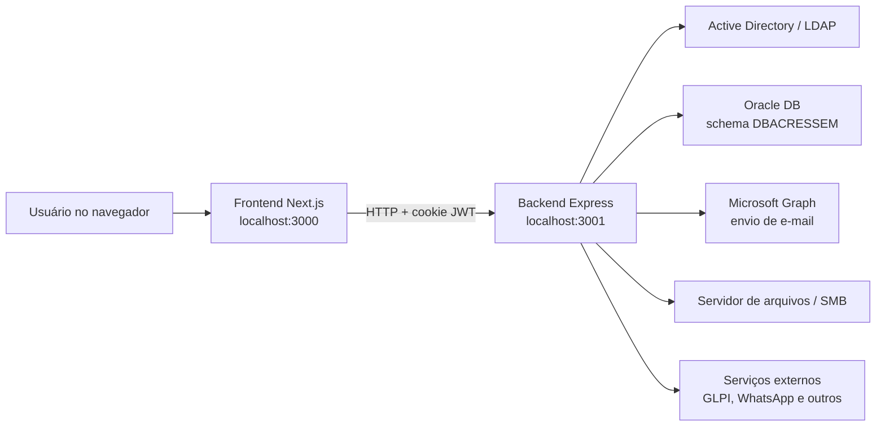
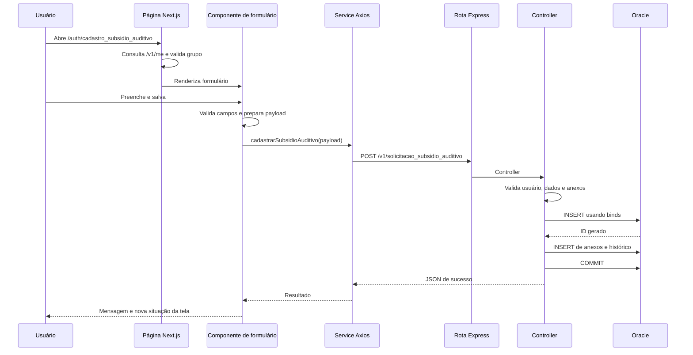
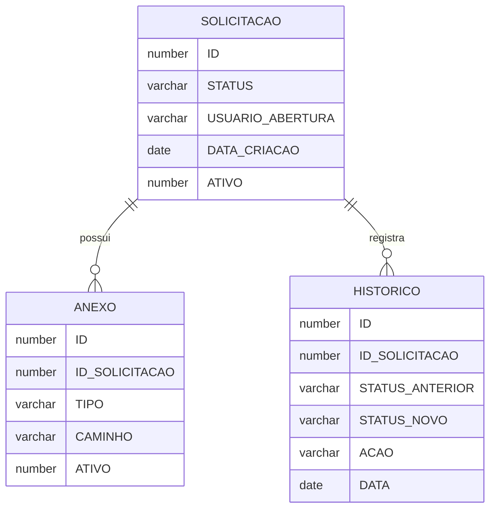
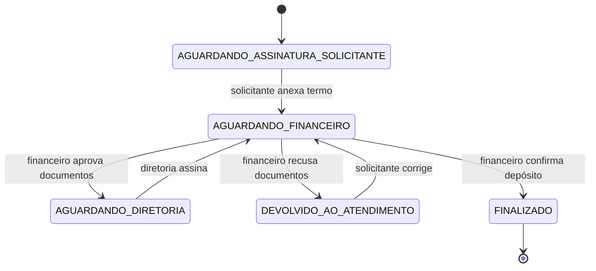

# Guia completo da Intranet Cressem

Este documento explica a arquitetura, os padrões e o fluxo de desenvolvimento da
Intranet Cressem. Ele foi escrito com base no código atual do repositório, não em
uma arquitetura genérica.

O objetivo é permitir que uma pessoa consiga:

- entender como frontend, backend, Oracle, Active Directory e serviços externos se conectam;
- localizar rapidamente onde cada responsabilidade fica;
- corrigir erros sem alterar o lugar errado;
- criar uma tela nova seguindo os padrões existentes;
- implementar formulários, PDFs, anexos, e-mails, permissões e fluxos de aprovação;
- testar uma mudança antes de disponibilizá-la.

> Este guia descreve o estado atual do projeto. Algumas partes mais antigas usam
> padrões diferentes das funcionalidades mais novas. Quando houver mais de uma
> forma de fazer a mesma coisa, o guia aponta o padrão recomendado.

## Sumário

1. [Visão geral](#1-visão-geral)
2. [Estrutura do repositório](#2-estrutura-do-repositório)
3. [Como executar localmente](#3-como-executar-localmente)
4. [Tecnologias e mapa funcional](#4-tecnologias-principais)
5. [Fluxo completo de uma requisição](#5-fluxo-completo-de-uma-requisição)
6. [Frontend em detalhes](#6-frontend-em-detalhes)
7. [Backend em detalhes](#7-backend-em-detalhes)
8. [Autenticação](#8-autenticação)
9. [Fluxos por status](#9-fluxos-por-status)
10. [Anexos e armazenamento](#10-anexos-e-armazenamento)
11. [E-mails](#11-e-mails)
12. [Perfis de teste](#12-perfis-de-teste)
13. [Variáveis de ambiente](#13-e-mails-e-variáveis-de-ambiente)
14. [Auditoria e observabilidade](#14-auditoria-e-observabilidade)
15. [Rotinas agendadas](#15-rotinas-agendadas)
16. [Relatórios de meta e hierarquia](#16-relatórios-de-meta-e-hierarquia)
17. [Como criar uma funcionalidade nova](#17-como-criar-uma-funcionalidade-nova)
18. [Checklist de revisão](#18-checklist-de-revisão)
19. [Pontos de atenção atuais](#19-pontos-de-atenção-atuais)
20. [Estratégia de Git](#20-estratégia-de-git)
21. [Diagnóstico rápido](#21-diagnóstico-rápido)
22. [Glossário](#22-glossário)
23. [Arquivos mais importantes](#23-arquivos-mais-importantes-para-estudar)
24. [Ordem sugerida de estudo](#24-ordem-sugerida-de-estudo)

---

## 1. Visão geral

A Intranet Cressem é uma aplicação web interna composta por dois projetos:

| Camada | Caminho | Tecnologia | Porta local |
| --- | --- | --- | --- |
| Frontend | `frontend/intranet` | Next.js 16, React 19, TypeScript, Tailwind CSS | `3000` |
| Backend | `backend/intranet-api` | Express 5, TypeScript, OracleDB | `3001` |

O frontend exibe as páginas, formulários, tabelas, modais e PDFs. O backend
autentica o usuário, aplica permissões, consulta e altera o banco Oracle, envia
e-mails, salva anexos e executa rotinas agendadas.



---

## 2. Estrutura do repositório

```text
C:\Intranet-Cressem
├── README.md
├── docs/
│   └── GUIA_COMPLETO_DO_PROJETO.md
├── frontend/
│   └── intranet/
│       ├── app/
│       ├── components/
│       ├── config/
│       ├── hooks/
│       ├── lib/
│       ├── public/
│       ├── services/
│       └── utils/
└── backend/
    └── intranet-api/
        ├── index.ts
        ├── scripts/
        └── src/
            ├── config/
            ├── controllers/
            ├── cron/
            ├── helper/
            ├── middleware/
            ├── routes/
            └── services/
```

### 2.1 Caminhos corretos

Os projetos executáveis são:

- `C:\Intranet-Cressem\frontend\intranet`
- `C:\Intranet-Cressem\backend\intranet-api`

Sempre confira o diretório atual antes de executar `npm`, porque cada projeto
possui seu próprio `package.json`.

---

## 3. Como executar localmente

### 3.1 Backend

```powershell
cd C:\Intranet-Cressem\backend\intranet-api
npm install
npm run dev
```

O backend normalmente responde em:

```text
http://localhost:3001
```

### 3.2 Frontend

Em outro terminal:

```powershell
cd C:\Intranet-Cressem\frontend\intranet
npm install
npm run dev
```

O frontend normalmente responde em:

```text
http://localhost:3000
```

### 3.3 Comandos de validação

Frontend:

```powershell
cd C:\Intranet-Cressem\frontend\intranet
npm.cmd run lint
npm.cmd run build
```

Backend:

```powershell
cd C:\Intranet-Cressem\backend\intranet-api
npx.cmd tsc --noEmit
npm.cmd run test:smoke:routes
```

O `npm.cmd` evita o bloqueio de `npm.ps1` quando a política de execução do
PowerShell não permite scripts.

O comando `tsc --noEmit` é útil quando o backend em execução mantém arquivos da
pasta `dist` bloqueados. Ele valida os tipos sem tentar sobrescrever a compilação.

---

## 4. Tecnologias principais

### 4.1 Frontend

- Next.js com App Router;
- React;
- TypeScript;
- Tailwind CSS;
- Axios para chamadas HTTP;
- jsPDF e jsPDF AutoTable para documentos;
- React Icons e Lucide para ícones;
- Recharts para gráficos;
- XLSX para planilhas.

### 4.2 Backend

- Node.js;
- Express;
- TypeScript;
- `oracledb` para Oracle;
- `ldapts` para Active Directory;
- JWT em cookie;
- Microsoft Graph para e-mails;
- `express-fileupload` e Multer para uploads;
- SMB para arquivos de rede;
- `node-cron` para rotinas agendadas;
- Socket.IO para comunicação em tempo real;
- integrações auxiliares com GLPI, WhatsApp, Ghostscript e outros serviços.

### 4.3 Mapa funcional

O projeto reúne módulos de várias áreas da cooperativa. A tabela abaixo serve
como ponto de partida para localizar uma funcionalidade.

| Área | Exemplos de telas | Principais locais |
| --- | --- | --- |
| Geral | home, aniversariantes, ramais, links úteis | páginas em `app/auth` e controllers de dashboard/ramais |
| Agência e crédito | análise de limite, cheque especial, auditoria, margem | componentes de formulário e controllers de crédito |
| Financeiro | recibos, CNAB, termos mensais, reembolsos, subsídios | formulários, gerenciamento, histórico, e-mails e PDFs |
| RH | férias, funcionários, cargos, posições, bolsa, demissão | componentes RH e controllers de gerenciamento |
| Contratos | cadastro, consulta, vencimentos e notificações | controllers de contratos e cron de vencimento |
| Benefícios | convênio odontológico e subsídios | cadastro, gerenciamento, relatórios e tabelas auxiliares |
| Marketing | participação, patrocínio e popup | controllers de participação/patrocínio e notificações |
| TI | notebooks, estoque, GLPI, DocuSign, termos | integrações, arquivos, ferramentas e páginas administrativas |
| Relatórios | produção/meta por funcionário e PA | controllers de meta, queries e componentes de tabela |
| Documentos | DPS, declarações, procurações, termos | formulários e geradores em `lib/pdf` |
| Ferramentas | conversão, marca d'água, juntar PDF, simuladores | services específicos e bibliotecas no frontend/backend |

#### Como localizar uma funcionalidade pelo nome

Exemplo: `gerenciamento_subsidio_auditivo`.

Procure, nesta ordem:

```text
frontend/intranet/app/auth/gerenciamento_subsidio_auditivo
frontend/intranet/components/gerenciamento-subsidio-auditivo-form
frontend/intranet/services/gerenciamento_subsidio_auditivo.service.ts
backend/intranet-api/src/routes/routes.ts
backend/intranet-api/src/controllers/solicitacao-subsidio-auditivo.controller.ts
backend/intranet-api/src/controllers/solicitacao_subsidio_auditivo_paginado.controller.ts
```

O nome pode alternar entre hífen e underscore:

- URL e pasta de página: geralmente underscore;
- pasta de componente: geralmente hífen;
- arquivo de service: geralmente underscore;
- arquivo de controller: há padrões com hífen e com underscore.

Por isso, ao pesquisar, use partes do nome:

```powershell
rg -n "subsidio.*auditivo" frontend backend
```

---

## 5. Fluxo completo de uma requisição

Exemplo: o usuário abre uma tela de subsídio e salva uma solicitação.



Cada camada deve cumprir uma função:

| Camada | Responsabilidade |
| --- | --- |
| Página | título, acesso inicial e composição visual |
| Componente | estado da tela, campos, validações e interação |
| Service | contrato HTTP com o backend |
| Rota | URL, método e middlewares |
| Controller | regra de negócio e transação |
| Oracle | persistência, constraints e integridade |

---

## 6. Frontend em detalhes

## 6.1 App Router e páginas

As páginas autenticadas ficam em:

```text
frontend/intranet/app/auth/<nome_da_tela>/page.tsx
```

Exemplo:

```text
app/auth/cadastro_subsidio_auditivo/page.tsx
```

O padrão atual de uma página nova é:

1. declarar `"use client"` quando utilizar estado, efeitos ou navegador;
2. consultar o usuário com `getMeAdUser()` ou `useMe()`;
3. verificar o acesso com `canAccess()` e uma regra de `PAGE_ACCESS`;
4. exibir estado de carregamento;
5. exibir mensagem de acesso negado;
6. montar cabeçalho com `BackButton`, ícone, título e descrição;
7. renderizar o componente principal da funcionalidade.

Exemplo resumido:

```tsx
"use client";

import { useEffect, useState } from "react";
import BackButton from "@/components/back-button/back-button";
import { canAccess, PAGE_ACCESS } from "@/lib/access-control";
import { getMeAdUser } from "@/services/auth.service";

export default function MinhaPagina() {
  const [loading, setLoading] = useState(true);
  const [allowed, setAllowed] = useState(false);

  useEffect(() => {
    async function validarAcesso() {
      try {
        const user = await getMeAdUser();
        setAllowed(canAccess(user, PAGE_ACCESS.minhaTela));
      } finally {
        setLoading(false);
      }
    }

    validarAcesso();
  }, []);

  if (loading) return <div className="p-6">Carregando...</div>;
  if (!allowed) return <div className="p-6">Acesso negado.</div>;

  return (
    <div className="p-6 lg:p-8">
      <BackButton />
      <h1>Minha tela</h1>
      <MeuFormulario />
    </div>
  );
}
```

### Layout autenticado

O arquivo `app/auth/layout.tsx` envolve todas as páginas autenticadas com:

- menu lateral;
- popup de avisos;
- área principal;
- rodapé.

O layout raiz, em `app/layout.tsx`, configura:

- idioma `pt-br`;
- fonte Asap;
- metadados;
- monitor de sessão expirada;
- CSS global.

---

## 6.2 Componentes

Os componentes ficam em:

```text
frontend/intranet/components
```

O projeto usa, principalmente, uma pasta por funcionalidade:

```text
components/
├── cadastro-subsidio-auditivo-form/
│   └── cadastro-subsidio-auditivo-form.tsx
├── gerenciamento-subsidio-auditivo-form/
│   └── gerenciamento-subsidio-auditivo-form.tsx
└── producao-meta-funcionario/
    └── producao-meta-funcionario.tsx
```

### Responsabilidades recomendadas do componente

- armazenar estado dos campos;
- realizar validações de experiência do usuário;
- formatar CPF, CNPJ, datas, moeda e telefone;
- chamar services;
- exibir carregamento, erro e sucesso;
- controlar modal;
- organizar tabela e paginação;
- direcionar o usuário conforme o status.

Evite colocar SQL, credenciais ou regra de autorização sensível no componente.

---

## 6.3 Padrão visual atual

As cores institucionais estão em `app/globals.css`:

```css
--primary: #00AE9D;
--secondary: #79B729;
--third: #C7D300;
--fourth: #49479D;
```

Padrões usados nas telas novas:

```tsx
const inputClass =
  "w-full rounded-xl border border-slate-300 bg-white px-3 py-2.5 ...";

const cardClass =
  "rounded-2xl border border-slate-200 bg-white p-5 shadow-sm";
```

Convenções visuais:

- fundo geral cinza muito claro;
- cards brancos com borda suave;
- títulos em `slate-900`;
- descrições em `slate-500` ou `gray-600`;
- botão principal verde;
- alertas amarelos para atenção;
- verde para sucesso;
- vermelho para erro ou recusa;
- azul para consulta/download;
- campos agrupados por assunto, não apenas por tabela.

### Responsividade

Use grids progressivos:

```tsx
className="grid gap-4 md:grid-cols-2 xl:grid-cols-3"
```

Tabelas largas devem ficar dentro de:

```tsx
<div className="overflow-x-auto">
  <table className="min-w-full">...</table>
</div>
```

Não esconda colunas importantes apenas para caber na tela. Prefira rolagem
horizontal, quebra de linha controlada e larguras mínimas.

---

## 6.4 Menu e catálogo de telas

Existem dois pontos importantes:

### `components/nav/nav.tsx`

Controla o menu lateral:

- grupos e subgrupos;
- ícones;
- links;
- visibilidade conforme grupos do AD;
- estado aberto/fechado;
- destaque da rota atual.

### `config/screens.ts`

É o catálogo pesquisável de telas:

- título;
- descrição;
- URL;
- categoria;
- palavras-chave;
- grupos permitidos;
- indicador de tela fixada.

Ao criar uma página, normalmente é necessário:

1. criar `app/auth/<rota>/page.tsx`;
2. adicionar a tela no menu de `nav.tsx`;
3. adicionar a tela em `config/screens.ts`;
4. adicionar a regra em `lib/access-control.ts`.

Se um desses passos faltar, a tela pode existir mas ficar difícil de localizar,
não aparecer no menu ou não validar corretamente o acesso.

---

## 6.5 Services HTTP

Os services ficam em:

```text
frontend/intranet/services
```

Um service normalmente:

- cria ou reutiliza uma instância Axios;
- usa `NEXT_PUBLIC_API_URL`;
- envia cookies com `withCredentials: true`;
- expõe tipos do payload e da resposta;
- centraliza URLs;
- registra erros da tela;
- acrescenta cabeçalhos de auditoria em alterações.

Exemplo:

```ts
const api = axios.create({
  baseURL: process.env.NEXT_PUBLIC_API_URL,
  withCredentials: true,
  timeout: 15000,
});

export async function salvar(payload: MeuPayload) {
  const { data } = await api.post("/v1/minha-rota", payload, {
    headers: getAuditoriaHeaders(),
  });

  return data;
}
```

### Cabeçalho de auditoria

`utils/auditoria-headers.ts` envia:

```text
x-tela-origem: URL atual da página
```

O backend usa essa informação para definir o contexto de auditoria no Oracle.

### Registro automático de erros

Vários services possuem interceptador Axios que chama:

```text
POST /v1/error-logs
```

O erro é gravado na tabela `DBACRESSEM.INTRANET_ERROR_LOGS`. Caso o Oracle
falhe, o backend tenta registrar um TXT em `logs/intranet-errors.txt`.

É importante ignorar a própria rota de log no interceptador para não criar um
loop infinito.

---

## 6.6 Formatação de campos

### CPF e CNPJ

O padrão é:

- mostrar com máscara;
- remover pontuação antes de enviar ao backend;
- salvar apenas dígitos quando a coluna foi projetada assim;
- aceitar CPF ou CNPJ conforme a regra do campo.

Função típica:

```ts
function onlyDigits(value: string) {
  return String(value || "").replace(/\D/g, "");
}
```

### Moeda digitada em centavos

Para o comportamento:

```text
1   -> 0,01
11  -> 0,11
111 -> 1,11
```

o valor digitado deve ser interpretado como centavos:

```ts
function formatarMoedaDigitada(value: string) {
  const digitos = value.replace(/\D/g, "");
  return formatarMoeda(Number(digitos) / 100);
}
```

Na API, envie número, não a string formatada:

```ts
function moedaParaNumero(value: string) {
  return Number(
    value
      .replace(/[^\d,.-]/g, "")
      .replace(/\./g, "")
      .replace(",", ".")
  );
}
```

### Datas

Recomendação:

- input e API: `YYYY-MM-DD`;
- exibição: `DD/MM/YYYY`;
- histórico: `DD/MM/YYYY HH:mm:ss`;
- Oracle: `DATE`;
- conversão SQL explícita com `TO_DATE`;
- retorno formatado com `TO_CHAR`.

Evite depender de conversão implícita do Oracle ou do fuso do navegador.

---

## 6.7 Validação e experiência de erro

O frontend deve validar antes de enviar, mas o backend deve repetir a validação.

Quando houver erro:

1. exibir mensagem clara;
2. destacar o campo;
3. rolar a tela até o feedback ou primeiro campo inválido;
4. não apagar o que o usuário já preencheu;
5. manter o botão bloqueado durante a requisição.

Exemplo:

```ts
feedbackRef.current?.scrollIntoView({
  behavior: "smooth",
  block: "start",
});
```

Não confie apenas no atributo HTML `required`, principalmente em formulários
com campos condicionais, anexos ou valores derivados.

---

## 6.8 PDFs

Os geradores ficam em:

```text
frontend/intranet/lib/pdf
```

O padrão mais recente usa jsPDF e funções pequenas para:

- carregar e converter a logo;
- desenhar cabeçalho de seção;
- desenhar campos;
- controlar quebra de página;
- escrever trechos normais e em negrito;
- desenhar assinaturas;
- sanitizar o nome do arquivo;
- converter datas.

Exemplo de organização:

```ts
type PdfMinhaTelaOpts = {
  nome: string;
  cpf: string;
  valor: string;
};

export async function gerarPdfMinhaTela(opts: PdfMinhaTelaOpts) {
  const doc = new jsPDF({
    unit: "pt",
    format: "a4",
    compress: true,
    putOnlyUsedFonts: true,
  });

  // desenho do documento
  doc.save("meu_documento.pdf");
}
```

### Cuidados com a logo

Para evitar fundo preto:

- prefira PNG com transparência válida;
- converta a imagem por canvas para PNG quando necessário;
- informe corretamente o tipo em `doc.addImage`;
- teste no visualizador do navegador e em leitor de PDF;
- mantenha fallback textual caso a imagem falhe.

### Regras de layout

- campos relacionados na mesma seção;
- largura homogênea;
- valores monetários alinhados;
- dados preenchidos em negrito quando solicitado;
- assinaturas com linha preta;
- nome abaixo da linha;
- não usar textos redundantes como “ASSINATURA” quando o nome identifica o campo;
- usar `ensureSpace` antes de blocos altos.

---

## 7. Backend em detalhes

## 7.1 Inicialização

O ponto de entrada é:

```text
backend/intranet-api/index.ts
```

Ele:

1. carrega `.env`;
2. importa os arquivos de cron;
3. configura Express;
4. habilita CORS para o frontend local;
5. habilita cookies;
6. disponibiliza arquivos de `/bucket`;
7. configura upload;
8. configura limites de JSON e URL encoded;
9. registra acessos;
10. registra as rotas;
11. inicializa o pool Oracle;
12. cria servidor HTTP e Socket.IO;
13. inicia rotinas de estoque;
14. trata encerramento gracioso.

### Limites

O upload e o body JSON usam limites altos porque alguns documentos são enviados
em base64. Isso funciona, mas arquivos muito grandes aumentam memória e tempo de
requisição. Para funcionalidades novas de grande volume, prefira multipart ou
upload direto para armazenamento.

---

## 7.2 Rotas

As rotas ficam centralizadas em:

```text
backend/intranet-api/src/routes/routes.ts
```

Atualmente o arquivo possui centenas de declarações de rota. O padrão é:

```ts
routes.get(
  "/v1/minha-rota",
  authMiddleware,
  authorizeGroups(["GG_MEUGRUPO"]),
  meuController.listar
);
```

Métodos usados:

- `GET`: consulta;
- `POST`: criação, geração ou ação;
- `PUT`: edição ou atualização completa;
- `PATCH`: alteração parcial;
- `DELETE`: exclusão lógica ou física, conforme a funcionalidade.

### Padrão recomendado para novas rotas

Toda rota com dados internos deve considerar:

1. `authMiddleware`;
2. `authorizeGroups` quando a autorização for puramente por grupo;
3. validação contextual no controller quando depender do registro, criador ou status;
4. controller separado;
5. retorno HTTP coerente.

Não basta esconder uma página no menu.

---

## 7.3 Controllers

Os controllers ficam em:

```text
backend/intranet-api/src/controllers
```

Um controller é responsável por:

- validar parâmetros;
- obter o usuário autenticado;
- verificar permissão contextual;
- converter tipos;
- montar SQL;
- executar a transação;
- salvar anexos;
- registrar histórico;
- enviar notificação;
- devolver resposta consistente.

Estrutura recomendada:

```ts
async criar(req: AuthenticatedRequest, res: Response) {
  const pool = await getOraclePool();
  const connection = await pool.getConnection();

  try {
    await setAuditoriaContext(connection, req);

    // validar
    // inserir
    // inserir dependências

    await connection.commit();
    return res.status(201).json({ success: true });
  } catch (error) {
    await connection.rollback();
    return res.status(500).json({ error: "Falha ao cadastrar." });
  } finally {
    await connection.close();
  }
}
```

### Status HTTP

| Código | Uso |
| --- | --- |
| `200` | consulta ou alteração bem-sucedida |
| `201` | criação bem-sucedida |
| `400` | campo, anexo ou transição inválida |
| `401` | usuário não autenticado |
| `403` | autenticado, mas sem permissão |
| `404` | registro não encontrado |
| `409` | conflito de estado ou duplicidade |
| `500` | falha inesperada |

---

## 7.4 Oracle

### Pool

O pool é inicializado em:

```text
src/config/oracle.pool.ts
```

Configuração:

- usuário;
- senha;
- connect string;
- mínimo e máximo de conexões;
- incremento do pool.

O pool é criado uma vez no bootstrap e reutilizado.

### Binds

Use binds em toda entrada variável:

```ts
await connection.execute(
  `
    SELECT *
    FROM DBACRESSEM.MINHA_TABELA
    WHERE ID = :id
  `,
  { id },
  { outFormat: oracledb.OUT_FORMAT_OBJECT }
);
```

Nunca concatene texto informado pelo usuário diretamente no SQL.

### Helpers

`src/services/oracle.service.ts` possui:

- `oracleExecute`: sem commit automático;
- `oracleExecuteCommit`: com commit automático;
- `oracleExecuteManyCommit`: lote com commit;
- versões com contexto de auditoria.

Para operações com várias etapas, obtenha a conexão manualmente e controle:

```ts
commit()
rollback()
close()
```

### Datas

Exemplo:

```sql
TO_DATE(:DT_SOLICITACAO, 'YYYY-MM-DD')
```

Retorno:

```sql
TO_CHAR(DT_SOLICITACAO, 'YYYY-MM-DD') AS DT_SOLICITACAO_FMT
```

### Exclusão lógica

Muitas tabelas usam:

```text
SN_ATIVO = 1
```

Em vez de apagar, atualize para `0` quando for necessário manter histórico.

### Identity

Colunas:

```sql
GENERATED ALWAYS AS IDENTITY
```

não devem receber ID manualmente no `INSERT`. Para recuperar o ID:

```sql
RETURNING ID_REGISTRO INTO :ID_OUT
```

---

## 7.5 Modelo de banco recomendado para fluxos

Os fluxos novos, como subsídio auditivo e funeral, usam três responsabilidades:

### Tabela principal

Guarda:

- dados da solicitação;
- usuário de abertura;
- status atual;
- responsáveis;
- datas de transição;
- valores;
- flag de ativo.

### Tabela de anexos

Guarda:

- vínculo com a solicitação;
- tipo do anexo;
- nome original;
- caminho do arquivo;
- MIME type;
- tamanho;
- usuário do upload;
- data;
- ativo.

### Tabela de histórico

Guarda:

- status anterior;
- novo status;
- ação;
- observação;
- usuário;
- data.



### Constraints

Use constraints para impedir estados impossíveis:

```sql
CONSTRAINT CK_STATUS CHECK (
  ST_SOLICITACAO IN (
    'AGUARDANDO_ASSINATURA_SOLICITANTE',
    'AGUARDANDO_FINANCEIRO',
    'AGUARDANDO_DIRETORIA',
    'DEVOLVIDO_AO_ATENDIMENTO',
    'FINALIZADO',
    'CANCELADO'
  )
)
```

Para anexos limitados a um por categoria, pode ser usado índice único
condicional considerando apenas registros ativos.

---

## 8. Autenticação

## 8.1 Login no Active Directory

O login é realizado em:

```text
POST /v1/login_sem_automatico
```

O controller:

1. recebe usuário e senha;
2. realiza bind no LDAP;
3. busca o usuário por `sAMAccountName`;
4. carrega nome, departamento, local, e-mail, ramal e `memberOf`;
5. converte os DNs de grupo em nomes simples;
6. cria JWT.

O token contém:

```ts
{
  sub: username,
  nome_completo,
  department,
  physicalDeliveryOfficeName,
  grupos,
  email,
  ramal
}
```

O token é salvo no cookie:

```text
access_token
```

com:

- `httpOnly`;
- `sameSite: lax`;
- `secure` em produção;
- duração configurável.

### Usuário atual

```text
GET /v1/me
```

retorna os dados decodificados do token.

---

## 8.2 Middleware de autenticação

`auth.middleware.ts` procura o token:

1. no cookie `access_token`;
2. no header `Authorization: Bearer`.

Depois valida o JWT e preenche:

```ts
req.user
```

Sem token: `401`.

Token inválido ou expirado: `401`.

---

## 8.3 Autorização

Existem três níveis diferentes:

### Nível 1: visibilidade no menu

Definida no menu lateral e no catálogo de telas.

Serve para experiência do usuário, não para segurança definitiva.

### Nível 2: proteção da página

Definida por:

```text
lib/access-control.ts
components/access-guard/access-guard.tsx
```

Uma regra pode permitir:

- grupos;
- usuários específicos;
- gerente ou diretor.

### Nível 3: backend e regra contextual

É a segurança real.

Exemplos:

- somente quem abriu pode editar uma solicitação devolvida;
- somente financeiro pode aprovar documentos;
- somente diretoria pode anexar assinatura da diretoria;
- suporte pode visualizar, mas não necessariamente movimentar;
- gestor pode ver subordinados conforme a hierarquia.

Uma autorização contextual deve consultar:

- usuário autenticado;
- grupos;
- criador do registro;
- status atual;
- relação hierárquica;
- ação solicitada.

---

## 8.4 Grupos do AD

Os nomes centralizados ficam em:

```text
frontend/intranet/config/ad-groups.ts
```

Exemplos:

| Constante | Grupo |
| --- | --- |
| `SUPORTE` | `GG_USERS_SUPORTE` |
| `FINANCEIRO` | `GG_USERS_FIN` |
| `GERENCIA_DIRETORIA` | `GG_USERS_GERENCIA_DIRETORIA` |
| `TODO_MUNDO` | `GG_INTRANET_FULL` |
| `META_PA` | `GG_INTRANET_META_PA` |
| `RH_INTRANET` | `GG_INTRANET_RH` |

Evite repetir essas strings em muitos arquivos. O projeto ainda possui algumas
duplicações no menu e em controllers, mas novas funcionalidades devem preferir
constantes centralizadas.

---

## 9. Fluxos por status

Os fluxos de reembolso e subsídios funcionam como máquinas de estado. O usuário
não deve conseguir executar uma ação apenas porque um botão apareceu; o backend
deve validar a transição.

### Exemplo: subsídio auditivo



### Matriz de ações

| Status | Quem atua | Ação |
| --- | --- | --- |
| Aguardando assinatura | solicitante | anexar termo assinado |
| Aguardando financeiro | financeiro | aprovar ou devolver |
| Devolvido ao atendimento | criador | corrigir cadastro/anexos |
| Aguardando diretoria | diretoria | anexar termo aprovado |
| Aguardando financeiro após diretoria | financeiro | confirmar depósito |
| Finalizado | ninguém | apenas consulta |

### Regra importante

O suporte pode ter acesso amplo para diagnóstico, mas não deve automaticamente
assumir o papel de solicitante, financeiro ou diretoria.

---

## 10. Anexos e armazenamento

O projeto possui mais de um padrão de upload:

- base64 dentro do JSON em fluxos mais novos;
- `express-fileupload`;
- Multer em rotas específicas;
- armazenamento local;
- armazenamento em compartilhamento SMB;
- caminho salvo no Oracle.

### Padrão dos subsídios

O frontend monta:

```ts
{
  TP_ANEXO,
  NM_ARQUIVO_ORIGINAL,
  NR_TAMANHO_BYTES,
  DS_MIME_TYPE,
  ARQUIVO: dataUrl
}
```

O backend:

1. normaliza o tipo;
2. valida se o tipo é permitido;
3. decodifica o arquivo;
4. salva no diretório configurado;
5. grava caminho e metadados;
6. desativa ou substitui anexo anterior da mesma categoria.

Tipos do subsídio auditivo:

```text
DOCUMENTOS_GERAIS
ORCAMENTOS_NOTA_FISCAL
AUTORIZACAO_ASSINADA_SOLICITANTE
AUTORIZACAO_ASSINADA_DIRETORIA
```

Esses valores precisam coincidir entre:

- select do frontend;
- normalização do backend;
- constraint Oracle.

Se um tipo divergir, o Oracle retorna violação de check constraint.

### Segurança de arquivos

- não aceite caminho arbitrário informado pelo navegador;
- sanitize nomes;
- limite tamanho;
- valide extensão e MIME type;
- gere nome interno seguro;
- confira se o download está dentro da pasta permitida;
- não exponha credenciais SMB.

---

## 11. E-mails

O serviço principal fica em:

```text
backend/intranet-api/src/services/email.service.ts
```

Ele usa Microsoft Graph com credenciais de aplicação.

Fluxo:

1. obtém token OAuth com tenant, client ID e client secret;
2. monta o e-mail HTML;
3. envia pela caixa departamental;
4. salva em itens enviados.

### Modo de teste global

Quando:

```env
EMAIL_MODO_TESTE=true
EMAIL_DESTINO_TESTE=seu.email@dominio
```

o serviço substitui todos os destinatários pelo endereço de teste.

Esse é o mecanismo mais seguro para testar fluxos sem notificar financeiro,
diretoria ou solicitantes reais.

### Destinatários por processo

Alguns módulos usam variáveis específicas, por exemplo:

- e-mail do financeiro;
- e-mail da diretoria;
- e-mail de debug do subsídio;
- e-mail de debug do reembolso;
- e-mail de alertas.

O criador da solicitação costuma ser localizado por:

- e-mail salvo;
- login salvo;
- consulta ao Active Directory;
- nome de abertura, como último recurso de identificação.

### Boas práticas

- assunto deve identificar o processo e a etapa, sem expor informação desnecessária;
- não dependa de um e-mail para mudar o status;
- altere e confirme a transação primeiro;
- trate falha de notificação separadamente quando possível;
- em teste, confirme visualmente que o modo de teste está ativo.

---

## 12. Perfis de teste

Os subsídios possuem arquivos como:

```text
lib/subsidio-auditivo-perfil-teste.ts
lib/subsidio-funeral-perfil-teste.ts
```

Eles permitem simular:

```ts
"FINANCEIRO"
"DIRETORIA"
null
```

Regras:

- `null`: comportamento real;
- `FINANCEIRO`: usuário de teste assume ações financeiras;
- `DIRETORIA`: usuário de teste assume ações da diretoria.

O modo precisa existir no frontend e ser aceito de forma controlada no backend.
Liberar somente o botão no frontend gera `403` na ação. Liberar apenas no
backend não mostra os controles corretos.

Nunca permita que qualquer usuário escolha livremente um perfil por header.
O backend deve validar uma lista restrita de usuários autorizados ao teste.

Antes de produção, mantenha o valor em:

```ts
null
```

---

## 13. E-mails e variáveis de ambiente

Não versione valores secretos. Documente apenas os nomes.

### Frontend

```env
NEXT_PUBLIC_API_URL=http://localhost:3001
```

### Backend - aplicação

```env
PORT=3001
NODE_ENV=development
MAX_PDF_UPLOAD_MB=50
JWT_SECRET=
JWT_EXPIRES_IN=180m
JWT_COOKIE_MAX_AGE_MS=
```

### Backend - Active Directory

```env
LDAP_URL=
LDAP_BASE_DN=
LDAP_DOMAIN=
```

### Backend - Oracle

```env
ORACLE_USER=
ORACLE_PASSWORD=
ORACLE_CONNECT_STRING=
ORACLE_POOL_MIN=1
ORACLE_POOL_MAX=10
ORACLE_POOL_INCREMENT=1
```

### Backend - Microsoft Graph

```env
TENANTID=
CLIENTID=
CLIENTSECRET=
DEPARTAMENTBOX=
EMAIL_TIMEOUT_MS=20000
EMAIL_MODO_TESTE=true
EMAIL_DESTINO_TESTE=
```

### Backend - arquivos e processos

```env
SMB_SERVER=
SMB_SHARE=
SMB_DOMAIN=
SMB_USER=
SMB_PASSWORD=
PDF_STORAGE_PATH=
REEMBOLSO_DESPESA_BASE_PATH=
SUBSIDIO_FUNERAL_BASE_PATH=
SUBSIDIO_AUDITIVO_BASE_PATH=
```

### Backend - destinatários

```env
FINANCEIRO_EMAIL=
DIRETORIA_EMAIL=
REEMBOLSO_FINANCEIRO_EMAIL=
REEMBOLSO_DIRETORIA_EMAIL=
SUBSIDIO_FUNERAL_DIRETORIA_EMAIL=
SUBSIDIO_AUDITIVO_DIRETORIA_EMAIL=
```

Existem outras variáveis para GLPI, WhatsApp, Ghostscript, monitoramento,
estoque e depuração de metas. Consulte as referências `process.env` do módulo
antes de executá-lo.

---

## 14. Auditoria e observabilidade

O projeto possui três mecanismos:

### Registro de acesso

`registrar-acesso.middleware.ts` grava:

- usuário;
- nome;
- tela;
- método HTTP;
- IP;
- user-agent;
- data.

### Contexto Oracle

`setAuditoriaContext` configura:

- `DBMS_APPLICATION_INFO.SET_MODULE`;
- `DBMS_SESSION.SET_IDENTIFIER`;
- `DBMS_APPLICATION_INFO.SET_CLIENT_INFO`.

Triggers ou auditorias do Oracle podem usar essas informações.

### Registro de erro

O frontend envia erros para `/v1/error-logs`, incluindo:

- usuário;
- página;
- mensagem;
- stack;
- detalhes da requisição;
- origem.

Evite enviar senha, token, arquivo em base64 ou dados financeiros completos em
`ERROR_DETAIL`.

---

## 15. Rotinas agendadas

Os crons ficam em:

```text
backend/intranet-api/src/cron
```

Exemplos:

- férias;
- vencimento de contratos;
- lembrete de sala.

Use sempre:

```ts
{
  timezone: "America/Sao_Paulo"
}
```

Ao criar cron:

1. coloque a regra principal em um service;
2. deixe o arquivo cron apenas agendar e tratar logs;
3. evite duplicidade na reinicialização;
4. garanta idempotência;
5. registre no banco que a notificação já foi enviada;
6. importe ou inicialize explicitamente no bootstrap.

---

## 16. Relatórios de meta e hierarquia

Os relatórios:

- `producao_meta_funcionario`;
- `producao_meta_cooperativa_pa`;

possuem regras adicionais de escopo.

### Meta por funcionário

O usuário autenticado é associado ao funcionário pelo nome completo retornado
pelo AD, não pela coluna de login de outro sistema.

Um gestor deve visualizar:

- a si próprio;
- subordinados diretos;
- subordinados indiretos, conforme a hierarquia.

### Meta por PA

Além da hierarquia de funcionários, existe vínculo entre:

- PA;
- gestor do PA;
- superior do gestor.

O escopo precisa considerar a árvore completa, não somente o PA do usuário.

### Modo de depuração

Existem variáveis de ambiente de debug para simular gestores e testar o escopo.
Elas devem ficar desligadas em produção.

---

## 17. Como criar uma funcionalidade nova

Exemplo: `solicitacao_auxilio_exemplo`.

### Passo 1: definir a regra

Antes do código, responda:

- quem cria?
- quem visualiza?
- quem edita?
- existem aprovações?
- quais status?
- quais anexos?
- gera PDF?
- envia e-mail?
- há limite de valor?
- precisa de histórico?

### Passo 2: desenhar o banco

Crie script em:

```text
backend/intranet-api/scripts
```

Para fluxo, considere:

```text
SOLICITACAO_AUXILIO_EXEMPLO
AUXILIO_EXEMPLO_ANEXO
AUXILIO_EXEMPLO_HISTORICO
```

Inclua:

- identity;
- chaves estrangeiras;
- checks de status;
- checks de valor;
- `SN_ATIVO`;
- índices de busca;
- índice único de anexo ativo por categoria, quando aplicável.

### Passo 3: controller

Crie:

```text
src/controllers/solicitacao-auxilio-exemplo.controller.ts
```

Implemente:

- criar;
- editar;
- buscar por ID;
- atualizar status;
- download;
- validação;
- permissão contextual;
- transação;
- histórico;
- e-mail.

### Passo 4: listagem paginada

Para telas de gerenciamento, crie controller paginado ou método de listagem com:

- pesquisa;
- status;
- página;
- limite;
- total;
- total de páginas;
- filtro por perfil.

### Passo 5: rotas

Adicione em `src/routes/routes.ts`:

```ts
routes.post(
  "/v1/solicitacao_auxilio_exemplo",
  authMiddleware,
  controller.criar
);
```

Repita para os demais endpoints.

### Passo 6: service frontend

Crie:

```text
services/cadastro_auxilio_exemplo.service.ts
services/gerenciamento_auxilio_exemplo.service.ts
```

Defina tipos e funções.

### Passo 7: componentes

Crie:

```text
components/cadastro-auxilio-exemplo-form/
components/gerenciamento-auxilio-exemplo-form/
```

### Passo 8: páginas

Crie:

```text
app/auth/cadastro_auxilio_exemplo/page.tsx
app/auth/gerenciamento_auxilio_exemplo/page.tsx
```

### Passo 9: acesso e navegação

Atualize:

- `config/ad-groups.ts`, se houver grupo novo;
- `lib/access-control.ts`;
- `components/nav/nav.tsx`;
- `config/screens.ts`.

### Passo 10: PDF

Se necessário:

```text
lib/pdf/gerarPdfAuxilioExemplo.ts
```

### Passo 11: testar o fluxo

Teste:

1. usuário sem acesso;
2. criador;
3. financeiro;
4. diretoria;
5. devolução;
6. correção;
7. anexos errados;
8. ausência de anexo;
9. valor máximo;
10. e-mail em modo de teste;
11. finalização;
12. histórico.

---

## 18. Checklist de revisão

### Frontend

- [ ] página está em `app/auth`;
- [ ] acesso foi configurado;
- [ ] menu e pesquisa incluem a tela;
- [ ] campos têm máscara;
- [ ] valores são enviados como número;
- [ ] datas usam formato consistente;
- [ ] erros levam o usuário até o problema;
- [ ] botões bloqueiam durante envio;
- [ ] tabela funciona em telas menores;
- [ ] modal possui rolagem;
- [ ] anexos limpam o seletor após inclusão;
- [ ] PDF foi conferido visualmente.

### Backend

- [ ] rota possui autenticação;
- [ ] permissão foi validada no backend;
- [ ] SQL usa binds;
- [ ] transação usa commit e rollback;
- [ ] conexão fecha no `finally`;
- [ ] datas são convertidas explicitamente;
- [ ] tipos de anexo coincidem com a constraint;
- [ ] histórico é gravado;
- [ ] erros não revelam segredos;
- [ ] e-mail respeita modo de teste.

### Banco

- [ ] identity não recebe valor manual;
- [ ] FKs existem;
- [ ] checks refletem os status reais;
- [ ] índices atendem filtros;
- [ ] valor máximo está protegido;
- [ ] exclusão lógica está definida;
- [ ] script pode ser executado em ordem.

---

## 19. Pontos de atenção atuais

Esta seção registra decisões e dívidas técnicas observadas no código atual.

### 19.1 Proteção não está totalmente uniforme

Algumas rotas usam `authMiddleware` e `authorizeGroups`; outras rotas antigas
possuem proteção diferente ou nenhuma proteção explícita na declaração.

Antes de publicar uma funcionalidade, confira a rota, não apenas a página.

### 19.2 Grupos estão repetidos

Os grupos AD aparecem em mais de um arquivo:

- `config/ad-groups.ts`;
- `config/screens.ts`;
- `components/nav/nav.tsx`;
- controllers.

O ideal futuro é centralizar os nomes para reduzir divergências.

### 19.3 Alguns padrões são legados

Há controllers pequenos usando helpers e controllers grandes concentrando
consulta, upload, e-mail e fluxo no mesmo arquivo.

Para código novo, prefira separar:

- controller;
- service de domínio;
- repositório/consulta;
- serviço de arquivos;
- serviço de notificação.

### 19.4 Segredos não devem ter fallback real no código

O código atual possui alguns fallbacks de desenvolvimento para JWT/LDAP. Em
produção, todas as configurações sensíveis devem ser obrigatórias no ambiente.

### 19.5 Registro de acesso e ordem dos middlewares

O middleware global de acesso é executado antes de várias rotas aplicarem
`authMiddleware`. Dependendo da rota, o acesso pode ser registrado como
`ANONIMO`.

Se a auditoria exigir usuário em todas as rotas autenticadas, a ordem precisa
ser revisada ou o token deve ser decodificado antes do registro.

### 19.6 Upload base64

É simples para PDFs pequenos, porém aumenta o payload aproximadamente em 33% e
carrega o arquivo inteiro na memória.

### 19.7 Cron de sala

O arquivo de lembrete exporta uma função de inicialização. Ao alterar esse cron,
confirme que a função está realmente sendo chamada no bootstrap; apenas importar
um arquivo que não agenda no topo não inicia a rotina.

### 19.8 README antigo

Historicamente o README indicava `cd backend` e `cd frontend`, mas os
`package.json` ficam um nível abaixo. Os comandos corretos estão neste guia e no
README atualizado.

---

## 20. Estratégia de Git

O projeto usa:

- `dev`: desenvolvimento e validação;
- `main`: versão estável/produção.

Fluxo recomendado:

```text
feature -> dev -> testes -> main
```

Antes de commit:

```powershell
git status
git diff --check
```

Não misture uma correção pequena com alterações não relacionadas. Como o projeto
costuma ter uma árvore de trabalho com mudanças em andamento, revise exatamente
quais arquivos serão incluídos.

---

## 21. Diagnóstico rápido

### Frontend não atualizou

- reinicie `npm run dev`;
- use `Ctrl+F5`;
- confirme que editou `frontend/intranet`;
- verifique `NEXT_PUBLIC_API_URL`;
- observe erros no console.

### Backend não atualizou

- reinicie `npm run dev`;
- confirme que editou `backend/intranet-api`;
- rode `npx.cmd tsc --noEmit`;
- confira se a rota foi registrada;
- confira o terminal do backend.

### Botão não aparece

- confira status;
- confira grupo;
- confira criador;
- confira modo de teste;
- confira se o detalhe retornou campos de identidade;
- confira se o frontend e o backend concordam sobre a permissão.

### Botão aparece, mas retorna 403

O frontend liberou a ação, mas o backend não reconheceu o papel. Compare:

- grupos de `/v1/me`;
- header de perfil de teste;
- usuário salvo na abertura;
- regra do controller;
- status no banco.

### ORA-02290

Uma check constraint foi violada. Verifique:

- nome exato do status;
- tipo de anexo;
- tipo da conta;
- limite de valor;
- flag de ativo.

### ORA-32795

Foi enviado valor para uma coluna `GENERATED ALWAYS AS IDENTITY`. Retire a
coluna do `INSERT`.

### Build não grava em `dist`

O backend pode estar rodando e mantendo os arquivos bloqueados. Use:

```powershell
npx.cmd tsc --noEmit
```

ou pare o processo antes do build completo.

---

## 22. Glossário

| Termo | Significado no projeto |
| --- | --- |
| AD | Active Directory usado para autenticação e grupos |
| PA | ponto de atendimento |
| Service frontend | arquivo que chama a API |
| Controller | regra HTTP e de negócio no backend |
| Bind | parâmetro seguro enviado ao Oracle |
| Identity | coluna numérica gerada pelo Oracle |
| Constraint | regra de integridade do banco |
| Exclusão lógica | manter registro e alterar `SN_ATIVO` |
| Solicitante | usuário que iniciou o processo |
| Atendimento | etapa responsável por cadastrar/corrigir |
| Financeiro | perfil que confere documentação e pagamento |
| Diretoria | perfil que aprova/assina |
| Modo de teste | simulação controlada de perfil ou destinatário |
| Histórico | trilha de mudanças de status |

---

## 23. Arquivos mais importantes para estudar

### Arquitetura e autenticação

- `backend/intranet-api/index.ts`
- `backend/intranet-api/src/routes/routes.ts`
- `backend/intranet-api/src/controllers/auth.controller.ts`
- `backend/intranet-api/src/middleware/auth.middleware.ts`
- `backend/intranet-api/src/middleware/authorize-groups.middleware.ts`

### Oracle e auditoria

- `backend/intranet-api/src/config/oracle.pool.ts`
- `backend/intranet-api/src/services/oracle.service.ts`
- `backend/intranet-api/src/middleware/registrar-acesso.middleware.ts`
- `frontend/intranet/utils/auditoria-headers.ts`

### Frontend e acesso

- `frontend/intranet/app/auth/layout.tsx`
- `frontend/intranet/components/nav/nav.tsx`
- `frontend/intranet/config/screens.ts`
- `frontend/intranet/config/ad-groups.ts`
- `frontend/intranet/lib/access-control.ts`
- `frontend/intranet/hooks/use-me.ts`

### Fluxo completo moderno

- `frontend/intranet/components/cadastro-subsidio-auditivo-form/`
- `frontend/intranet/components/gerenciamento-subsidio-auditivo-form/`
- `frontend/intranet/services/cadastro_subsidio_auditivo.service.ts`
- `frontend/intranet/services/gerenciamento_subsidio_auditivo.service.ts`
- `backend/intranet-api/src/controllers/solicitacao-subsidio-auditivo.controller.ts`
- `backend/intranet-api/src/controllers/solicitacao_subsidio_auditivo_paginado.controller.ts`
- `backend/intranet-api/scripts/create-subsidio-auditivo.sql`

### PDF

- `frontend/intranet/lib/pdf/gerarPdfSubsidioAuditivo.ts`
- `frontend/intranet/lib/pdf/gerarPdfDeclaracaoResponsabilidadeHolerite.ts`

### E-mail e arquivos

- `backend/intranet-api/src/services/email.service.ts`
- `backend/intranet-api/src/services/smb2.service.ts`
- `backend/intranet-api/src/helper/upload-pasta.ts`

---

## 24. Ordem sugerida de estudo

Para aprender o projeto sem se perder:

1. leia as seções 1 a 6 deste guia;
2. abra uma página simples e siga até o componente;
3. siga a chamada do componente até o service;
4. localize a rota;
5. abra o controller;
6. identifique SQL e binds;
7. estude autenticação e grupos;
8. estude um PDF simples;
9. estude o fluxo completo do subsídio auditivo;
10. execute localmente e acompanhe uma requisição no navegador e terminal;
11. faça uma alteração pequena;
12. rode lint e TypeScript.

O melhor exercício é escolher um campo visível e rastrear todo o caminho:

```text
input -> estado React -> payload -> service -> rota -> controller -> bind
-> coluna Oracle -> SELECT -> resposta -> service -> componente -> PDF/tabela
```

Quando você consegue seguir esse ciclo, já entendeu a espinha dorsal do projeto.
