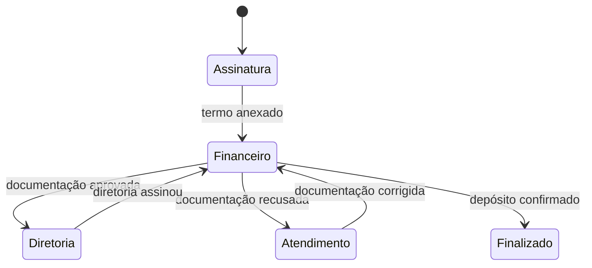
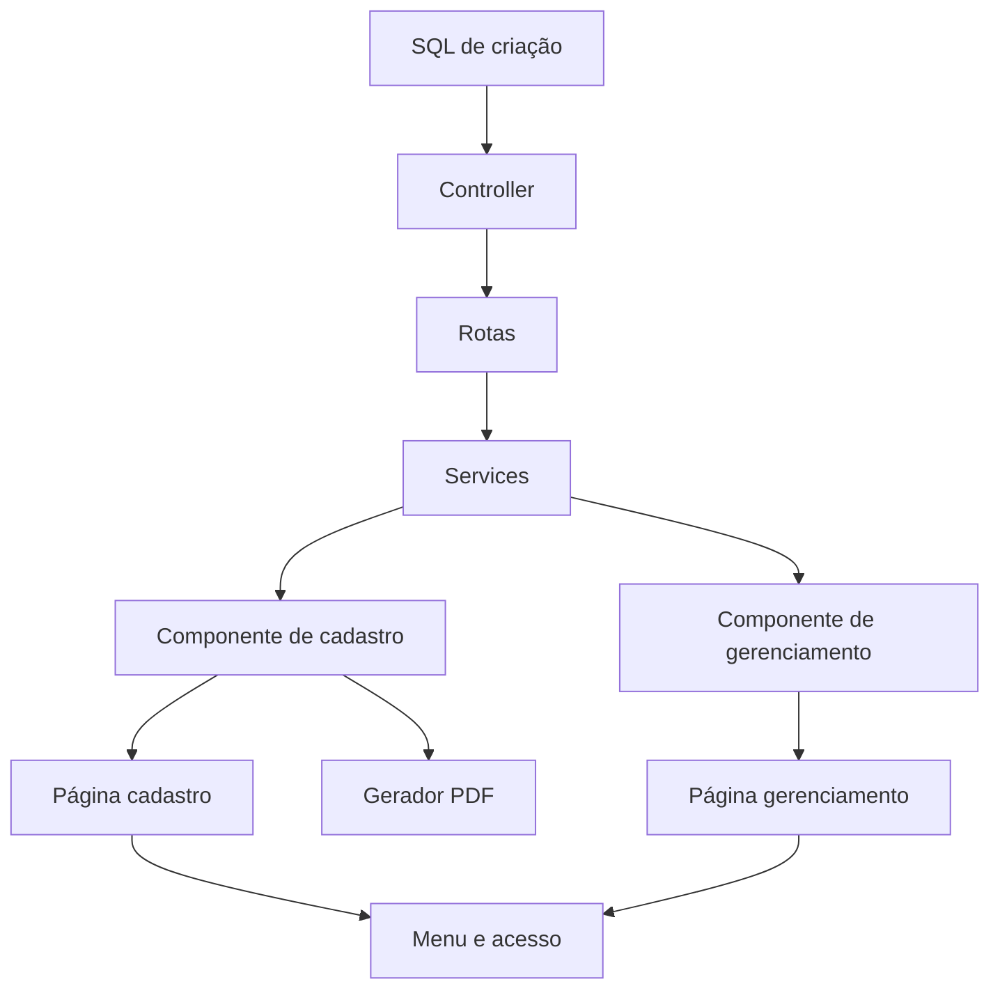

# Manual didático da Intranet Cressem

## Aprenda o projeto entendendo o caminho dos dados

Este manual foi criado para ensinar o projeto de forma progressiva. Ele não
substitui o guia técnico existente:

- `GUIA_COMPLETO_DO_PROJETO.md`: referência técnica rápida;
- `MANUAL_DIDATICO_DO_PROJETO.md`: material de estudo, explicação e prática.

Aqui, o objetivo não é apenas dizer onde um arquivo fica. A ideia é explicar:

- por que ele existe;
- como conversa com os outros arquivos;
- o que acontece quando o usuário realiza uma ação;
- como raciocinar para encontrar e corrigir um problema;
- como criar uma funcionalidade sem depender de decorar o projeto.

Você não precisa dominar Next.js, React, Express ou Oracle antes de começar.
Cada conceito será apresentado dentro do contexto real da Intranet.

---

## Como usar este manual

Você pode estudar de três formas:

### Leitura completa

Leia os capítulos na ordem. É a melhor opção se você quer entender o projeto
como um todo.

### Consulta durante um chamado

Use o sumário para ir diretamente ao assunto:

- tela não aparece;
- botão não funciona;
- erro no Oracle;
- problema de permissão;
- PDF;
- anexos;
- e-mail;
- fluxo de aprovação.

### Estudo com prática

Abra os arquivos indicados enquanto lê. No final de vários capítulos existem:

- perguntas de conferência;
- exercícios;
- pequenas alterações seguras para praticar;
- checklist do que você deve ter entendido.

---

## Sumário

### Parte I - Entendendo o sistema

1. [O projeto explicado sem código](#aula-1-o-projeto-explicado-sem-código)
2. [O mapa mental mais importante](#aula-2-o-mapa-mental-mais-importante)
3. [Preparando e executando o ambiente](#aula-3-preparando-e-executando-o-ambiente)
4. [Aprendendo a navegar no repositório](#aula-4-aprendendo-a-navegar-no-repositório)

### Parte II - Frontend

5. [O que é o frontend neste projeto](#aula-5-o-que-é-o-frontend-neste-projeto)
6. [Páginas do Next.js](#aula-6-páginas-do-nextjs)
7. [Componentes React e estado](#aula-7-componentes-react-e-estado)
8. [Services e comunicação com a API](#aula-8-services-e-comunicação-com-a-api)
9. [Formulários, máscaras e validação](#aula-9-formulários-máscaras-e-validação)
10. [Tabelas, modais e paginação](#aula-10-tabelas-modais-e-paginação)
11. [Menu, pesquisa e acesso](#aula-11-menu-pesquisa-e-acesso)
12. [Geração de PDF](#aula-12-geração-de-pdf)

### Parte III - Backend

13. [O que é o backend neste projeto](#aula-13-o-que-é-o-backend-neste-projeto)
14. [Rotas Express](#aula-14-rotas-express)
15. [Controllers e regras de negócio](#aula-15-controllers-e-regras-de-negócio)
16. [Oracle, SQL e binds](#aula-16-oracle-sql-e-binds)
17. [Transações, commit e rollback](#aula-17-transações-commit-e-rollback)
18. [Modelagem de tabelas](#aula-18-modelagem-de-tabelas)
19. [Anexos e arquivos](#aula-19-anexos-e-arquivos)
20. [E-mails](#aula-20-e-mails)

### Parte IV - Segurança e processos

21. [Login e Active Directory](#aula-21-login-e-active-directory)
22. [Permissão de tela e permissão de ação](#aula-22-permissão-de-tela-e-permissão-de-ação)
23. [Fluxos por status](#aula-23-fluxos-por-status)
24. [Histórico e auditoria](#aula-24-histórico-e-auditoria)
25. [Perfis e modos de teste](#aula-25-perfis-e-modos-de-teste)

### Parte V - Estudo de caso completo

26. [Subsídio auditivo do banco até a tela](#aula-26-subsídio-auditivo-do-banco-até-a-tela)
27. [Seguindo um campo ponta a ponta](#aula-27-seguindo-um-campo-ponta-a-ponta)
28. [Seguindo uma ação ponta a ponta](#aula-28-seguindo-uma-ação-ponta-a-ponta)

### Parte VI - Manutenção e evolução

29. [Como investigar um erro](#aula-29-como-investigar-um-erro)
30. [Erros comuns do Oracle](#aula-30-erros-comuns-do-oracle)
31. [Como criar uma funcionalidade nova](#aula-31-como-criar-uma-funcionalidade-nova)
32. [Como testar antes de publicar](#aula-32-como-testar-antes-de-publicar)
33. [Git e entrega](#aula-33-git-e-entrega)
34. [Trilha de exercícios](#aula-34-trilha-de-exercícios)
35. [Checklist final de domínio](#aula-35-checklist-final-de-domínio)

---

# Parte I - Entendendo o sistema

## Aula 1: O projeto explicado sem código

Imagine a Intranet como um escritório.

O usuário chega na recepção e pede um serviço:

> Quero cadastrar uma solicitação de subsídio auditivo.

O escritório possui setores diferentes.

### A recepção: frontend

O frontend:

- mostra os campos;
- explica o que deve ser preenchido;
- impede erros simples;
- organiza as informações;
- envia o pedido.

Ele não deve decidir sozinho se algo é realmente permitido. Uma pessoa pode
alterar o código do navegador ou chamar a API diretamente.

### O protocolo: rota

A rota recebe o pedido e indica para qual área ele deve ir:

```text
POST /v1/solicitacao_subsidio_auditivo
```

O método `POST` informa que o pedido pretende criar algo.

### O analista: controller

O controller:

- verifica os documentos;
- confere o usuário;
- valida os dados;
- executa a regra;
- fala com o banco;
- registra o histórico;
- responde ao frontend.

### O arquivo central: Oracle

O Oracle guarda:

- solicitação;
- anexos;
- status;
- responsáveis;
- histórico;
- datas;
- valores.

### O crachá: Active Directory

O Active Directory informa:

- quem é o usuário;
- nome completo;
- e-mail;
- departamento;
- grupos;
- permissões gerais.

### O correio: serviço de e-mail

Quando o processo muda de etapa, o serviço de e-mail avisa as pessoas
responsáveis.

### O arquivo morto ou compartilhamento: armazenamento

Os arquivos anexados são salvos no local configurado. O banco normalmente guarda
o caminho e os metadados, não apenas o conteúdo visual.

---

## Aula 2: O mapa mental mais importante

Quase toda funcionalidade do projeto pode ser entendida por esta sequência:

```text
Página
  ↓
Componente
  ↓
Service
  ↓
Rota
  ↓
Controller
  ↓
Oracle / arquivo / e-mail
```

E a resposta volta pelo caminho inverso:

```text
Oracle
  ↓
Controller
  ↓
Service
  ↓
Componente
  ↓
Usuário
```

Se você memorizar apenas uma coisa deste manual, memorize esse caminho.

### Exemplo real

Quando o usuário clica em salvar no cadastro do subsídio auditivo:

1. a página já carregou o componente;
2. o componente lê os estados dos campos;
3. o componente valida os campos;
4. o componente monta um payload;
5. o service envia o payload;
6. a rota direciona para o controller;
7. o controller valida novamente;
8. o controller abre uma conexão Oracle;
9. insere a solicitação;
10. recebe o ID gerado;
11. salva os anexos;
12. grava o histórico;
13. realiza commit;
14. retorna `201`;
15. o componente mostra sucesso.

### Como isso ajuda em erros

Se o campo aparece errado antes de salvar, olhe frontend.

Se o payload está errado, olhe componente e service.

Se a API retorna `400`, olhe validação do controller.

Se retorna `403`, olhe autorização.

Se retorna `ORA-...`, olhe SQL, binds e constraints.

Se salvou mas não aparece, olhe o `SELECT` e o preenchimento do formulário.

---

## Aula 3: Preparando e executando o ambiente

Existem dois projetos Node separados.

### Terminal do backend

```powershell
cd C:\Intranet-Cressem\backend\intranet-api
npm install
npm run dev
```

O backend usa a porta `3001`.

### Terminal do frontend

```powershell
cd C:\Intranet-Cressem\frontend\intranet
npm install
npm run dev
```

O frontend usa a porta `3000`.

### Por que dois terminais?

O frontend e o backend são programas diferentes.

Se você reiniciar apenas o backend:

- alterações em controller entram;
- alterações em SQL entram;
- alterações em permissão do backend entram;
- alterações visuais do frontend podem continuar antigas.

Se você reiniciar apenas o frontend:

- alterações visuais entram;
- services entram;
- a API continua com o código antigo.

### Quando usar Ctrl+F5

Use quando:

- o frontend já foi reiniciado;
- você ainda vê JavaScript ou CSS antigo;
- o navegador pode estar usando cache.

### Comandos de conferência

Frontend:

```powershell
npm.cmd run lint
```

Backend:

```powershell
npx.cmd tsc --noEmit
```

### Exercício

1. Abra os dois terminais.
2. Identifique em qual terminal aparece uma requisição API.
3. Altere um texto pequeno em uma página.
4. Observe se o Next.js atualiza automaticamente.
5. Reinicie somente o backend e confirme que o texto não depende dele.

---

## Aula 4: Aprendendo a navegar no repositório

Use pesquisa, não navegação manual infinita.

### Buscar arquivos

```powershell
rg --files | rg "subsidio"
```

### Buscar texto

```powershell
rg -n "AGUARDANDO_FINANCEIRO" frontend backend
```

### Buscar uma rota

```powershell
rg -n "solicitacao_subsidio_auditivo" backend/intranet-api/src/routes
```

### Nomes com hífen e underscore

O mesmo módulo pode aparecer assim:

```text
cadastro_subsidio_auditivo
cadastro-subsidio-auditivo-form
cadastro_subsidio_auditivo.service.ts
solicitacao-subsidio-auditivo.controller.ts
```

Não procure apenas o nome completo. Procure partes:

```powershell
rg -n "subsidio.*auditivo"
```

### Técnica de investigação

Quando você recebe um chamado:

1. copie um texto visível da tela;
2. pesquise esse texto;
3. encontre o componente;
4. veja qual service ele importa;
5. veja qual URL o service chama;
6. pesquise a URL nas rotas;
7. abra o controller.

Essa técnica é mais confiável que tentar adivinhar o arquivo.

---

# Parte II - Frontend

## Aula 5: O que é o frontend neste projeto

O frontend fica em:

```text
frontend/intranet
```

As principais pastas são:

| Pasta | O que guarda |
| --- | --- |
| `app` | páginas e layouts |
| `components` | formulários, tabelas, modais e partes reutilizáveis |
| `services` | comunicação com o backend |
| `lib` | acesso, PDFs, cálculos e utilidades |
| `config` | grupos e catálogo de telas |
| `hooks` | lógica React reutilizável |
| `public` | logos e arquivos públicos |
| `utils` | funções auxiliares |

### O que o frontend pode fazer

- validar campos;
- formatar valor;
- controlar interface;
- esconder ação;
- pedir confirmação;
- gerar PDF local;
- organizar anexos.

### O que ele não deve fazer sozinho

- garantir permissão;
- confiar no grupo recebido sem backend;
- executar SQL;
- armazenar segredo;
- decidir uma transição sensível sem validação da API.

---

## Aula 6: Páginas do Next.js

Uma URL:

```text
/auth/cadastro_subsidio_auditivo
```

é representada por:

```text
app/auth/cadastro_subsidio_auditivo/page.tsx
```

### Por que `page.tsx`?

No App Router do Next.js, a pasta define o caminho e o arquivo `page.tsx`
define o conteúdo.

### O que a página faz

A página do subsídio auditivo:

- marca o código como client component;
- consulta o usuário;
- verifica acesso;
- mostra carregamento;
- mostra acesso negado;
- monta cabeçalho;
- renderiza `CadastroSubsidioAuditivoForm`.

Ela não implementa todos os campos diretamente.

### Por que separar página e formulário?

Porque são responsabilidades diferentes.

Página:

- rota;
- título;
- permissão geral;
- layout.

Formulário:

- estado;
- preenchimento;
- regra de interação;
- chamadas.

### `"use client"`

É necessário quando o arquivo usa:

- `useState`;
- `useEffect`;
- eventos;
- `window`;
- navegação do cliente.

Sem ele, o Next.js entende que o componente pode ser executado no servidor.

### Exercício de leitura

Abra:

```text
frontend/intranet/app/auth/cadastro_subsidio_auditivo/page.tsx
```

Responda:

1. qual regra de acesso ele usa?
2. qual componente principal é renderizado?
3. o que aparece enquanto o usuário é carregado?
4. o que acontece se o acesso for negado?

---

## Aula 7: Componentes React e estado

Abra:

```text
components/cadastro-subsidio-auditivo-form/
cadastro-subsidio-auditivo-form.tsx
```

Esse arquivo é grande porque reúne várias responsabilidades de tela.

### O que é estado?

Estado é uma informação que pode mudar e fazer a tela renderizar novamente.

Exemplo:

```tsx
const [nomeAssociado, setNomeAssociado] = useState("");
```

- `nomeAssociado`: valor atual;
- `setNomeAssociado`: função que altera;
- `""`: valor inicial.

No input:

```tsx
<input
  value={nomeAssociado}
  onChange={(event) => setNomeAssociado(event.target.value)}
/>
```

### Estado derivado

Alguns valores não precisam de outro input. Eles são calculados.

Exemplo:

```tsx
const mesesAssociacao = useMemo(
  () => calcularMesesAssociacao(dataAssociacao),
  [dataAssociacao]
);
```

Quando `dataAssociacao` muda, o número de meses é recalculado.

### Regra do subsídio auditivo

O código usa:

```text
R$ 1.000,00 + meses de associação × R$ 12,70
```

No componente:

```tsx
const valorBaseSubsidio = 1000;
const valorMensalAssociacao = 12.7;
```

Depois:

```tsx
const valorAdicionalAssociacao =
  mesesAssociacao * valorMensalAssociacao;
```

### `useEffect`

É usado para executar algo quando o componente carrega ou quando uma dependência
muda.

Exemplo:

```tsx
useEffect(() => {
  carregarTela();
}, []);
```

O array vazio indica: execute uma vez após montar.

Outro exemplo atualiza automaticamente o valor aprovado quando a data de
associação muda.

### Cuidado com loops

Se um `useEffect` altera uma variável que está nas dependências, ele pode rodar
novamente.

Por isso o código compara:

- valor atual;
- último valor automático;
- valor calculado.

### Perguntas de conferência

1. Qual estado representa o CPF?
2. Qual estado representa os anexos?
3. Qual valor é calculado com `useMemo`?
4. Qual função preenche o formulário ao editar?

---

## Aula 8: Services e comunicação com a API

Abra:

```text
services/cadastro_subsidio_auditivo.service.ts
```

### Por que existe um service?

Sem service, cada componente teria URLs, Axios, headers e tipos espalhados.

O service é o tradutor entre frontend e API.

### Instância Axios

```ts
const api = axios.create({
  baseURL: API_BASE,
  withCredentials: true,
});
```

`baseURL`:

```text
http://localhost:3001
```

`withCredentials` permite enviar o cookie JWT.

### Tipos

```ts
export type SubsidioAuditivoPayload = {
  NM_ASSOCIADO: string;
  NR_CPF_ASSOCIADO: string;
  VL_CUSTO_APARELHO: number;
  ANEXOS: SubsidioAuditivoAnexoPayload[];
};
```

O tipo ajuda a detectar:

- campo faltando;
- nome errado;
- valor com formato incorreto.

### Função de cadastro

```ts
export async function cadastrarSubsidioAuditivo(payload) {
  const { data } = await api.post(
    "/v1/solicitacao_subsidio_auditivo",
    payload,
    { headers: getAuditoriaHeaders() }
  );

  return data;
}
```

### Como o componente usa

```ts
const payload = await montarPayload();
const resposta = await cadastrarSubsidioAuditivo(payload);
```

### Interceptador de erro

O service registra:

- URL;
- método;
- status;
- dados da resposta;
- página;
- mensagem.

Isso ajuda no diagnóstico posterior.

### Regra prática

Se a URL está errada, corrija o service.

Se os campos enviados estão errados, corrija `montarPayload`.

Se a API rejeita um campo válido, corrija o backend.

---

## Aula 9: Formulários, máscaras e validação

Um formulário bom possui três camadas de valor:

1. valor visual;
2. valor no estado;
3. valor enviado.

### Exemplo de CPF

Visual:

```text
477.836.638-77
```

Enviado:

```text
47783663877
```

O backend normalmente salva apenas dígitos.

### Exemplo de moeda

Visual:

```text
R$ 1.508,00
```

Enviado:

```json
1508
```

No banco:

```text
NUMBER(15,2)
```

### Por que não enviar `"R$ 1.508,00"`?

Porque:

- não é número;
- Oracle não deve depender da linguagem;
- cálculo se torna difícil;
- pontos e vírgulas podem ser interpretados errado.

### Validação frontend

Exemplo:

```ts
if (onlyDigits(cpfAssociado).length !== 11) {
  mostrarErroTopo("CPF do associado inválido.");
  return;
}
```

### Validação backend

O controller repete:

```ts
if (onlyDigits(body.NR_CPF_ASSOCIADO).length !== 11) {
  return "CPF do associado inválido.";
}
```

### Por que repetir?

O navegador não é uma fronteira de segurança.

Alguém pode:

- chamar a API com Postman;
- alterar JavaScript;
- enviar payload manual;
- reutilizar uma versão antiga do frontend.

### Subir a tela no erro

O padrão atual usa:

```ts
window.scrollTo({
  top: 0,
  behavior: "smooth",
});
```

Melhoria possível:

- guardar ref do primeiro campo inválido;
- chamar `scrollIntoView`;
- aplicar borda vermelha.

### Exercício

Escolha um campo e encontre:

1. estado;
2. input;
3. máscara;
4. validação frontend;
5. payload;
6. validação backend;
7. coluna Oracle.

---

## Aula 10: Tabelas, modais e paginação

As telas de gerenciamento usam:

- filtros;
- tabela;
- paginação;
- botão `Ver`;
- modal de detalhes;
- ações condicionais.

### Listagem

O service envia:

```text
pesquisa
status
page
limit
```

O backend devolve:

```json
{
  "rows": [],
  "page": 1,
  "limit": 10,
  "total": 37,
  "totalPages": 4
}
```

### Por que paginar no backend?

Se houver milhares de registros:

- baixar tudo é lento;
- consome memória;
- tabela demora;
- usuário não precisa de tudo de uma vez.

### Modal

Ao clicar em `Ver`:

1. o ID é conhecido;
2. frontend chama `GET /:id`;
3. backend valida visualização;
4. retorna detalhes, anexos e histórico;
5. modal monta os blocos.

### Overflow

Modal alto:

```tsx
className="max-h-[90vh] overflow-y-auto"
```

Tabela larga:

```tsx
className="overflow-x-auto"
```

### Ações condicionais

O modal não deve exibir todos os botões sempre.

Ele calcula:

```text
status + perfil + criador + anexos = ações disponíveis
```

---

## Aula 11: Menu, pesquisa e acesso

Criar uma página não faz ela aparecer automaticamente no menu.

### Quatro pontos

1. `app/auth/<rota>/page.tsx`
2. `components/nav/nav.tsx`
3. `config/screens.ts`
4. `lib/access-control.ts`

### Menu

Define onde o link aparece e qual grupo o vê.

### Screens

Define o catálogo pesquisável da home.

### Access control

Define regra para a página.

### Backend

Ainda precisa proteger a API.

### Erro comum

> Coloquei o grupo no menu, então está seguro.

Não está. O menu só esconde o link.

### Exercício

Escolha `Subsídio Auditivo - Cadastro` e localize:

- entrada em `screens.ts`;
- item no menu;
- regra em `PAGE_ACCESS`;
- verificação na página;
- `authMiddleware` na rota.

---

## Aula 12: Geração de PDF

O PDF é gerado no frontend com jsPDF.

### Entrada tipada

```ts
export type PdfSubsidioAuditivoOpts = {
  nomeAssociado: string;
  cpfAssociado: string;
  valorSolicitado: string;
  valorAprovado: string;
};
```

### Funções auxiliares

O gerador divide tarefas:

- `safeText`;
- `sanitize`;
- `loadImageDataURL`;
- `ensureSpace`;
- `drawSectionHeader`;
- `drawFieldBox`;
- `drawFieldsRow`;
- `drawSignature`.

### Por que funções pequenas?

Sem elas, o PDF vira uma longa sequência de coordenadas impossível de manter.

### Sistema de coordenadas

No jsPDF:

- `x` cresce da esquerda para direita;
- `y` cresce de cima para baixo;
- A4 tem largura e altura;
- cada desenho usa pontos.

### Cabeçalho de seção

```ts
drawSectionHeader(doc, "INFORMAÇÕES PARA ANÁLISE", x, y, width);
```

### Campos

```ts
drawFieldsRow(doc, y, x, totalW, [
  { label: "NOME", value: nome, width: 300 },
  { label: "CPF", value: cpf, width: 150 },
]);
```

### Quebra de página

Antes de desenhar um bloco:

```ts
y = ensureSpace(doc, {
  currentY: y,
  needed: alturaDoBloco,
  margin,
  pageH,
});
```

### Logo com fundo preto

O problema costuma ocorrer por:

- transparência inválida;
- imagem WebP/JPEG tratada como PNG;
- conversão incorreta;
- visualizador.

O padrão mais robusto:

1. buscar imagem;
2. carregar em `Image`;
3. desenhar em canvas;
4. converter canvas para PNG;
5. adicionar ao PDF.

### Teste visual obrigatório

Lint não detecta:

- texto cortado;
- linha fora do lugar;
- fundo preto;
- assinatura desalinhada;
- campo sobreposto.

Sempre gere um PDF real.

---

# Parte III - Backend

## Aula 13: O que é o backend neste projeto

O backend fica em:

```text
backend/intranet-api
```

Ele possui:

| Parte | Função |
| --- | --- |
| `index.ts` | inicia o servidor |
| `routes` | registra URLs |
| `controllers` | regras e respostas |
| `services` | integrações e operações reutilizáveis |
| `middleware` | autenticação, grupo, acesso |
| `config` | Oracle |
| `cron` | tarefas agendadas |
| `helper` | funções auxiliares |
| `scripts` | SQL de criação/alteração |

### Bootstrap

Ao iniciar:

1. `.env` é carregado;
2. crons são importados;
3. Express é criado;
4. CORS é configurado;
5. cookies são habilitados;
6. upload é configurado;
7. parser JSON é configurado;
8. rotas são registradas;
9. pool Oracle é criado;
10. servidor começa a ouvir.

---

## Aula 14: Rotas Express

Uma rota é a combinação:

```text
método + caminho + middlewares + controller
```

Exemplo:

```ts
routes.post(
  "/v1/solicitacao_subsidio_auditivo",
  authMiddleware,
  solicitacaoSubsidioAuditivoController.cadastrar
);
```

### Leitura

- `routes.post`: criação;
- URL: endereço chamado;
- `authMiddleware`: exige login;
- `cadastrar`: função executada.

### Rotas do módulo auditivo

| Método | URL | Ação |
| --- | --- | --- |
| POST | `/v1/solicitacao_subsidio_auditivo` | cadastrar |
| PUT | `/v1/solicitacao_subsidio_auditivo` | editar |
| GET | `/v1/solicitacao_subsidio_auditivo/:id` | buscar detalhe |
| PUT | `/v1/solicitacao_subsidio_auditivo/:id/status` | avançar fluxo |
| POST | `/v1/solicitacao_subsidio_auditivo/download` | baixar anexo |
| GET | `/v1/solicitacao_subsidio_auditivo_paginado` | listar |

### O que é `:id`?

Parâmetro de caminho.

```text
/v1/solicitacao_subsidio_auditivo/15
```

No controller:

```ts
const id = Number(req.params.id);
```

### Query string

Listagem:

```text
?page=1&limit=10&status=AGUARDANDO_FINANCEIRO
```

No controller:

```ts
req.query.page
req.query.status
```

### Body

Cadastro e edição recebem:

```ts
req.body
```

---

## Aula 15: Controllers e regras de negócio

O controller não é apenas um arquivo de SQL.

Ele deve responder:

- os dados são válidos?
- o usuário pode fazer isso?
- o status permite?
- há anexos obrigatórios?
- precisa salvar histórico?
- precisa enviar e-mail?
- tudo deve ser confirmado junto?

### Fluxo do método `cadastrar`

```ts
const erro = validarCadastro(req.body);
if (erro) return res.status(400).json({ error: erro });
```

Depois:

```ts
const pool = await getOraclePool();
const connection = await pool.getConnection();
```

Dentro do `try`:

1. configura auditoria;
2. interpreta anexos;
3. insere tabela principal;
4. obtém ID;
5. salva cada anexo;
6. insere metadados;
7. insere histórico;
8. commit.

No `catch`:

```ts
await connection.rollback();
```

No `finally`:

```ts
await connection.close();
```

### Regra de retorno

Não retorne apenas erro técnico.

Bom:

```json
{
  "error": "Falha ao cadastrar solicitação de subsídio auditivo.",
  "details": "ORA-..."
}
```

Para produção, avalie se `details` deve ser ocultado do usuário e mantido apenas
em log.

---

## Aula 16: Oracle, SQL e binds

### Conexão

O pool mantém conexões disponíveis.

```ts
const connection = await getOraclePool().getConnection();
```

### SQL com bind

```sql
SELECT *
FROM DBACRESSEM.SOLICITACAO_SUBSIDIO_AUDITIVO
WHERE ID_SUBSIDIO_AUDITIVO = :id
```

```ts
{ id }
```

### Por que bind?

- evita SQL injection;
- converte tipos;
- melhora reutilização do plano;
- separa código e valor.

### Errado

```ts
`WHERE ID = ${req.params.id}`
```

### Certo

```ts
`WHERE ID = :id`
```

### Datas

```sql
TO_DATE(:DT_ASSOCIACAO, 'YYYY-MM-DD')
```

### Retorno de data

```sql
TO_CHAR(DT_ASSOCIACAO, 'YYYY-MM-DD') AS DT_ASSOCIACAO_FMT
```

### Número

Converta no backend:

```ts
VL_CUSTO_APARELHO: toNumber(req.body.VL_CUSTO_APARELHO)
```

Não deixe Oracle interpretar texto monetário.

### `RETURNING`

Após inserir:

```sql
RETURNING ID_SUBSIDIO_AUDITIVO
INTO :ID_SUBSIDIO_AUDITIVO_OUT
```

Isso recupera a identity para os anexos e histórico.

---

## Aula 17: Transações, commit e rollback

Imagine:

1. solicitação foi inserida;
2. primeiro anexo foi inserido;
3. segundo anexo falhou.

Sem transação, ficaria um cadastro incompleto.

### Com transação

Até o commit, as alterações pertencem à operação atual.

Sucesso:

```ts
await connection.commit();
```

Erro:

```ts
await connection.rollback();
```

### Regra

Se várias alterações representam uma única ação de negócio, use a mesma
conexão e a mesma transação.

### Cuidado com `autoCommit`

Se cada insert usa:

```ts
autoCommit: true
```

você perde a capacidade de desfazer tudo junto.

---

## Aula 18: Modelagem de tabelas

O script auditivo cria três tabelas.

### Principal

```text
SOLICITACAO_SUBSIDIO_AUDITIVO
```

Guarda o estado atual.

### Anexo

```text
SUBSIDIO_AUDITIVO_ANEXO
```

Guarda os arquivos relacionados.

### Histórico

```text
SUBSIDIO_AUDITIVO_HISTORICO
```

Guarda a evolução.

### Por que não guardar tudo numa tabela?

Uma solicitação pode ter vários anexos e várias ações.

Se fossem colunas:

```text
ANEXO_1
ANEXO_2
ANEXO_3
```

o modelo ficaria rígido.

### Chave estrangeira

O anexo aponta para a solicitação:

```sql
FOREIGN KEY (ID_SUBSIDIO_AUDITIVO)
REFERENCES SOLICITACAO_SUBSIDIO_AUDITIVO
```

### Check constraint

```sql
TP_ANEXO IN (
  'DOCUMENTOS_GERAIS',
  'ORCAMENTOS_NOTA_FISCAL',
  'AUTORIZACAO_ASSINADA_SOLICITANTE',
  'AUTORIZACAO_ASSINADA_DIRETORIA'
)
```

Ela impede categorias desconhecidas.

### Índice

O índice acelera pesquisa, mas tem custo no insert/update.

Crie para:

- ID de relacionamento;
- status;
- CPF;
- login;
- filtros frequentes.

---

## Aula 19: Anexos e arquivos

### No frontend

O arquivo selecionado é um objeto `File`.

Para enviar em JSON:

```ts
FileReader.readAsDataURL(file)
```

Resultado:

```text
data:application/pdf;base64,JVBERi0x...
```

### No payload

```ts
{
  TP_ANEXO: "DOCUMENTOS_GERAIS",
  NM_ARQUIVO_ORIGINAL: "documentos.pdf",
  DS_MIME_TYPE: "application/pdf",
  NR_TAMANHO_BYTES: 123456,
  ARQUIVO: "data:application/pdf;base64,..."
}
```

### No backend

O backend:

1. valida o tipo;
2. sanitiza o nome;
3. decodifica;
4. monta diretório;
5. salva;
6. grava caminho.

### O banco guarda caminho

```text
DS_CAMINHO_ARQUIVO
```

### Tipos precisam ser idênticos

Há três lugares:

1. frontend;
2. backend;
3. constraint Oracle.

Se frontend enviar:

```text
ORCAMENTOS
```

e o banco só aceitar:

```text
ORCAMENTOS_NOTA_FISCAL
```

o backend precisa normalizar antes do insert.

### Substituição

Quando só pode existir um arquivo ativo de cada tipo:

- desative o anterior;
- salve o novo;
- mantenha histórico físico se necessário;
- respeite índice único.

---

## Aula 20: E-mails

O projeto envia por Microsoft Graph.

### Variáveis

```text
TENANTID
CLIENTID
CLIENTSECRET
DEPARTAMENTBOX
```

### Fluxo OAuth

1. backend pede token;
2. Microsoft valida aplicação;
3. Graph devolve access token;
4. backend chama `/sendMail`.

### Modo de teste

```env
EMAIL_MODO_TESTE=true
EMAIL_DESTINO_TESTE=seu.email@dominio
```

Quando ativo, todos os destinatários são substituídos.

### Por que o modo deve ficar no service central?

Se cada controller implementar seu próprio modo:

- um pode esquecer;
- outro pode mandar e-mail real;
- regras divergem.

### E-mail não é estado

Não use:

> Se o e-mail foi enviado, então o status mudou.

O banco é a fonte da verdade.

---

# Parte IV - Segurança e processos

## Aula 21: Login e Active Directory

### Login

O usuário informa:

- username;
- senha.

O backend realiza bind LDAP.

### Busca do usuário

Depois do bind:

```text
sAMAccountName
displayName
department
physicalDeliveryOfficeName
mail
telephoneNumber
memberOf
```

### Grupos

O AD devolve DNs:

```text
CN=GG_USERS_FIN,OU=...
```

O código extrai:

```text
GG_USERS_FIN
```

### JWT

O backend cria um token assinado.

O navegador recebe um cookie HTTP-only.

### Por que HTTP-only?

JavaScript do navegador não consegue ler o token diretamente, reduzindo risco em
alguns ataques XSS.

### `/v1/me`

O frontend pergunta:

> Quem está autenticado?

E recebe:

```json
{
  "username": "marcelo.bueno",
  "nome_completo": "MARCELO ...",
  "email": "...",
  "grupos": []
}
```

---

## Aula 22: Permissão de tela e permissão de ação

Existem duas perguntas diferentes.

### Pode abrir a tela?

Exemplo:

```ts
canAccess(user, PAGE_ACCESS.gerenciamentoSubsidioAuditivo)
```

### Pode executar esta ação neste registro?

Exemplo:

```text
É financeiro?
O status está AGUARDANDO_FINANCEIRO?
Já houve aprovação da diretoria?
Existe anexo obrigatório?
```

### Visualizar não significa movimentar

Suporte pode precisar:

- ver dados;
- baixar anexos;
- entender histórico.

Mas não deve automaticamente:

- aprovar;
- recusar;
- assinar;
- finalizar.

### Criador

O sistema compara usuário atual com:

```text
LOGIN_USUARIO_ABERTURA
NM_USUARIO_ABERTURA
```

Pode usar:

- login;
- e-mail;
- nome completo como fallback.

### Backend obrigatório

Mesmo que o botão esteja escondido:

```ts
if (!podeAtuarComoFinanceiro) {
  return res.status(403).json(...);
}
```

---

## Aula 23: Fluxos por status

Status é a posição atual do processo.

### Analogia

Uma encomenda pode estar:

- preparada;
- enviada;
- em transporte;
- entregue.

Não faz sentido “entregar” antes de “enviar”.

### Subsídio auditivo

```text
AGUARDANDO_ASSINATURA_SOLICITANTE
AGUARDANDO_FINANCEIRO
AGUARDANDO_DIRETORIA
DEVOLVIDO_AO_ATENDIMENTO
FINALIZADO
CANCELADO
```

### Máquina de estados



### Frontend

Calcula ações disponíveis para orientar o usuário.

### Backend

Valida a transição para garantir integridade.

### Banco

Constraint impede status inexistente.

---

## Aula 24: Histórico e auditoria

### Histórico de negócio

Responde:

- quem fez;
- quando;
- de qual status;
- para qual status;
- qual ação;
- qual observação.

### Auditoria técnica

Oracle recebe:

- módulo;
- ação/tela;
- identificador do usuário;
- IP.

### Registro de acesso

Tabela de acessos registra:

- rota;
- método;
- usuário;
- navegador;
- data.

### Registro de erro

Tabela de erro registra contexto do problema.

### Diferença

| Registro | Pergunta |
| --- | --- |
| Histórico | O que aconteceu com a solicitação? |
| Acesso | Quem entrou em qual rota? |
| Auditoria Oracle | Qual sessão alterou dados? |
| Error log | Qual falha ocorreu na aplicação? |

---

## Aula 25: Perfis e modos de teste

Testar fluxo exige assumir papéis.

### Opções

```ts
"FINANCEIRO"
"DIRETORIA"
null
```

### `null`

Comportamento real.

### Perfil simulado

O frontend:

- exibe selo;
- mostra ações;
- envia header.

O backend:

- lê header;
- valida se o usuário pertence à lista de testadores;
- assume papel somente naquela requisição.

### Erro que já aconteceu

O sistema considerava o usuário “em teste” apenas por estar na lista, mesmo
quando o perfil era `null`.

Consequência:

- deixou de reconhecê-lo como solicitante;
- nenhuma ação aparecia.

Aprendizado:

```text
usuário autorizado a testar ≠ teste ativo
```

As duas condições precisam ser verdadeiras:

```text
perfil selecionado + usuário autorizado
```

---

# Parte V - Estudo de caso completo

## Aula 26: Subsídio auditivo do banco até a tela

Esta aula percorre o módulo completo.

### 1. Banco

Script:

```text
backend/intranet-api/scripts/create-subsidio-auditivo.sql
```

Cria:

- principal;
- anexo;
- histórico;
- checks;
- índices.

### 2. Controller

```text
src/controllers/solicitacao-subsidio-auditivo.controller.ts
```

Possui:

- cadastro;
- edição;
- detalhe;
- status;
- download;
- arquivo;
- e-mail;
- histórico;
- permissão.

### 3. Controller paginado

```text
src/controllers/solicitacao_subsidio_auditivo_paginado.controller.ts
```

Filtra listagem pelo perfil.

### 4. Rotas

```text
src/routes/routes.ts
```

Liga URL e controller.

### 5. Services frontend

```text
services/cadastro_subsidio_auditivo.service.ts
services/gerenciamento_subsidio_auditivo.service.ts
```

### 6. Componentes

```text
components/cadastro-subsidio-auditivo-form
components/gerenciamento-subsidio-auditivo-form
```

### 7. Páginas

```text
app/auth/cadastro_subsidio_auditivo
app/auth/gerenciamento_subsidio_auditivo
```

### 8. PDF

```text
lib/pdf/gerarPdfSubsidioAuditivo.ts
```

### 9. Navegação e acesso

```text
components/nav/nav.tsx
config/screens.ts
lib/access-control.ts
```

### Visão integrada



---

## Aula 27: Seguindo um campo ponta a ponta

Vamos seguir:

```text
Valor solicitado / custo do aparelho
```

### No banco

```sql
VL_CUSTO_APARELHO NUMBER(15,2)
```

### No tipo frontend

```ts
VL_CUSTO_APARELHO: number;
```

### No estado

```tsx
const [custoAparelho, setCustoAparelho] = useState("");
```

Ele é string porque o usuário vê moeda formatada.

### No input

O valor é formatado enquanto digita.

### Na validação

O componente garante que foi preenchido.

### No payload

```ts
VL_CUSTO_APARELHO: parseBRL(custoAparelho)
```

### No service

Payload é enviado por Axios.

### Na rota

```text
POST /v1/solicitacao_subsidio_auditivo
```

### No controller

```ts
VL_CUSTO_APARELHO: toNumber(req.body.VL_CUSTO_APARELHO)
```

### No insert

```sql
:VL_CUSTO_APARELHO
```

### Na consulta

`s.*` retorna a coluna.

### Na edição

```tsx
fmtBRL(Number(detalhe.VL_CUSTO_APARELHO))
```

### Na tabela

Pode aparecer como valor solicitado.

### No PDF

É passado como:

```ts
valorSolicitado
```

### Diagnóstico

Se o valor aparece `150800`:

- confira máscara e `fmtBRL`.

Se salva `15.08`:

- confira `parseBRL`.

Se o Oracle rejeita:

- confira tipo e bind.

Se o PDF diverge:

- confira o objeto enviado ao gerador.

---

## Aula 28: Seguindo uma ação ponta a ponta

Vamos seguir:

```text
Financeiro aprova documentação
```

### Estado atual

```text
AGUARDANDO_FINANCEIRO
```

### Frontend identifica perfil

```tsx
const isFinanceiro =
  grupo financeiro || perfil de teste financeiro;
```

### Frontend identifica ação

```tsx
if (status === "AGUARDANDO_FINANCEIRO" && podeAtuarComoFinanceiro) {
  return [{
    acao: "APROVAR_FINANCEIRO",
    label: "Documentação ok, enviar à diretoria"
  }];
}
```

### Clique

`executarAcao("APROVAR_FINANCEIRO")`

### Service

```text
PUT /v1/solicitacao_subsidio_auditivo/:id/status
```

Body:

```json
{
  "acao": "APROVAR_FINANCEIRO",
  "observacao": "",
  "nomeResponsavel": "...",
  "loginResponsavel": "..."
}
```

### Backend identifica usuário

`getPerfilPermissaoSubsidio`.

### Backend valida status

```text
perfil financeiro + AGUARDANDO_FINANCEIRO
```

### Backend valida anexos

Confere documentos obrigatórios.

### Backend define novo status

```text
AGUARDANDO_DIRETORIA
```

### Banco

Atualiza:

- status;
- data de envio;
- responsável;
- atualização.

### Histórico

Registra a ação.

### E-mail

Notifica diretoria.

### Frontend

Busca detalhe novamente e atualiza modal/lista.

---

# Parte VI - Manutenção e evolução

## Aula 29: Como investigar um erro

Não comece alterando código. Primeiro classifique o problema.

### 1. Visual

Exemplos:

- coluna cortada;
- botão no lugar errado;
- PDF desalinhado.

Procure componente ou gerador PDF.

### 2. Estado frontend

Exemplos:

- campo não atualiza;
- seletor não limpa;
- botão não libera.

Procure:

- `useState`;
- `useMemo`;
- `useEffect`;
- condição de renderização.

### 3. Requisição

Exemplos:

- payload sem campo;
- URL errada;
- método errado.

Use aba Network e service.

### 4. Autorização

Exemplo:

```text
403
```

Compare:

- `/v1/me`;
- grupos;
- status;
- criador;
- perfil de teste;
- regra do backend.

### 5. Banco

Exemplo:

```text
ORA-02290
```

Leia o nome da constraint.

### 6. Infraestrutura

Exemplos:

- Oracle indisponível;
- pasta sem acesso;
- Graph sem token;
- SMB sem conexão.

### Método de isolamento

Pergunte:

> Qual foi a última camada que funcionou?

Se o frontend enviou payload correto, avance para backend.

Se controller recebeu correto, avance para SQL.

Se banco salvou correto, volte pela consulta.

---

## Aula 30: Erros comuns do Oracle

### ORA-02290

Check constraint violada.

Exemplo:

```text
CK_SUB_AUDITIVO_ANEXO_TIPO
```

Compare o valor enviado com a lista aceita.

### ORA-32795

Tentativa de inserir em identity `GENERATED ALWAYS`.

Solução:

- remover ID do insert;
- usar `RETURNING`.

### ORA-00001

Índice ou constraint única violada.

Pode indicar:

- anexo duplicado ativo;
- CPF único;
- código repetido.

### ORA-01400

Tentativa de inserir `NULL` em coluna `NOT NULL`.

Compare:

- coluna;
- bind;
- payload.

### ORA-00904

Identificador inválido.

Normalmente:

- nome de coluna errado;
- alias errado;
- alteração de tabela não refletida.

### ORA-01008

Nem todos os binds foram informados.

Conte os `:NOMES` no SQL e compare com o objeto.

### ORA-01861

Data/texto não corresponde ao formato.

Use `TO_DATE` com formato explícito.

---

## Aula 31: Como criar uma funcionalidade nova

Vamos imaginar:

```text
Auxílio Exemplo
```

### Fase 1: regra em português

Escreva antes:

- quem solicita?
- quais campos?
- qual limite?
- quais documentos?
- quem aprova?
- quem pode devolver?
- qual estado final?

### Fase 2: diagrama

```text
Cadastro
  -> Assinatura
  -> Financeiro
  -> Diretoria
  -> Financeiro
  -> Finalizado
```

### Fase 3: banco

Crie:

```text
SOLICITACAO_AUXILIO_EXEMPLO
AUXILIO_EXEMPLO_ANEXO
AUXILIO_EXEMPLO_HISTORICO
```

### Fase 4: backend mínimo

Implemente:

1. cadastrar;
2. buscar por ID;
3. listar paginado.

Teste antes de construir tela completa.

### Fase 5: frontend cadastro

Implemente:

- página;
- componente;
- service;
- validação;
- sucesso.

### Fase 6: gerenciamento

Implemente:

- filtros;
- tabela;
- modal;
- status;
- perfis.

### Fase 7: documentos

Implemente:

- anexos;
- PDF;
- download.

### Fase 8: notificações

Implemente e-mail depois que a regra de status estiver estável.

### Fase 9: menu e acesso

Atualize os quatro pontos.

### Fase 10: teste completo

Teste cada papel.

---

## Aula 32: Como testar antes de publicar

### Teste técnico

Frontend:

```powershell
npm.cmd run lint
npm.cmd run build
```

Backend:

```powershell
npx.cmd tsc --noEmit
npm.cmd run test:smoke:routes
```

### Teste de cadastro

- campo obrigatório vazio;
- CPF inválido;
- moeda;
- data;
- arquivo ausente;
- arquivo duplicado;
- limite.

### Teste de permissão

- usuário comum;
- criador;
- suporte;
- financeiro;
- diretoria.

### Teste de fluxo

- aprovação;
- devolução;
- correção;
- reenvio;
- assinatura;
- finalização.

### Teste de e-mail

Confirme:

```env
EMAIL_MODO_TESTE=true
```

### Teste de PDF

Abra e confira:

- logo;
- textos;
- valores;
- data;
- assinatura;
- quebra de página.

### Teste de regressão

Pergunte:

- alterei função compartilhada?
- alterei grupo?
- alterei tipo de anexo?
- alterei constraint?
- alterei service usado por outra tela?

---

## Aula 33: Git e entrega

### Ver alterações

```powershell
git status
git diff
```

### Conferir espaços e conflitos

```powershell
git diff --check
```

### Branches

```text
dev  -> desenvolvimento
main -> produção estável
```

### Commit

Um bom commit explica resultado:

```text
corrige permissão do solicitante no subsídio auditivo
```

Evite:

```text
ajustes
teste
coisas
```

### Árvore suja

O projeto frequentemente possui alterações não commitadas.

Antes de entregar:

1. identifique arquivos da sua tarefa;
2. não reverta arquivos de outra tarefa;
3. não use reset destrutivo;
4. revise o diff.

---

## Aula 34: Trilha de exercícios

Os exercícios estão organizados do mais simples ao mais completo.

### Nível 1: leitura

#### Exercício 1

Encontre a página de cadastro do subsídio funeral.

Objetivo:

- localizar `page.tsx`;
- identificar componente importado.

#### Exercício 2

Encontre a URL que lista subsídios auditivos.

Objetivo:

- localizar service;
- localizar rota;
- localizar controller.

#### Exercício 3

Encontre onde o grupo financeiro é definido.

Objetivo:

- identificar duplicações;
- compreender frontend e backend.

### Nível 2: alteração visual

#### Exercício 4

Altere apenas a descrição de uma página.

Valide:

- frontend atualiza;
- nenhuma API foi alterada.

#### Exercício 5

Adicione uma coluna de exibição usando um campo já retornado.

Valide:

- cabeçalho;
- célula;
- colspan;
- responsividade.

### Nível 3: formulário

#### Exercício 6

Adicione uma máscara simples a um campo.

Rastreie:

- valor visual;
- estado;
- payload.

#### Exercício 7

Adicione validação frontend e backend para o mesmo campo.

### Nível 4: banco

#### Exercício 8

Crie uma coluna opcional em uma tabela de teste.

Atualize:

- script;
- insert;
- select;
- tipo;
- formulário.

#### Exercício 9

Adicione uma check constraint e force um erro controlado.

### Nível 5: fluxo

#### Exercício 10

Desenhe uma máquina de estados para uma nova solicitação.

#### Exercício 11

Implemente uma ação permitida somente em um status.

#### Exercício 12

Registre histórico da ação.

### Nível 6: módulo completo

Crie um módulo pequeno com:

- cadastro;
- listagem;
- modal;
- status único;
- um anexo;
- PDF;
- acesso.

---

## Aula 35: Checklist final de domínio

Você entende o projeto quando consegue responder sem adivinhar:

### Arquitetura

- [ ] Sei a diferença entre página, componente, service, rota e controller.
- [ ] Sei seguir uma requisição ponta a ponta.
- [ ] Sei qual projeto reiniciar.

### Frontend

- [ ] Sei localizar uma página por URL.
- [ ] Sei encontrar estados e inputs.
- [ ] Sei montar e inspecionar payload.
- [ ] Sei adicionar validação.
- [ ] Sei ajustar tabela e modal.
- [ ] Sei localizar o gerador PDF.

### Backend

- [ ] Sei localizar uma rota.
- [ ] Sei entender um controller.
- [ ] Sei usar binds.
- [ ] Sei controlar commit e rollback.
- [ ] Sei diferenciar `400`, `401`, `403`, `404` e `500`.

### Banco

- [ ] Sei identificar tabela principal, anexo e histórico.
- [ ] Sei ler uma check constraint.
- [ ] Sei por que identity não recebe ID manual.
- [ ] Sei investigar um erro ORA.

### Segurança

- [ ] Sei que esconder botão não protege a API.
- [ ] Sei diferenciar visualização e ação.
- [ ] Sei como grupos AD chegam ao frontend/backend.
- [ ] Sei como o criador é identificado.

### Processo

- [ ] Sei desenhar o fluxo por status.
- [ ] Sei testar solicitante, financeiro e diretoria.
- [ ] Sei usar modo de e-mail de teste.
- [ ] Sei revisar histórico e notificações.

### Entrega

- [ ] Sei rodar lint.
- [ ] Sei rodar TypeScript sem emitir.
- [ ] Sei revisar `git diff`.
- [ ] Sei testar antes de enviar para `main`.

---

# Apêndice A: Roteiro de estudo em sete dias

## Dia 1

- aulas 1 a 4;
- executar os projetos;
- localizar cinco telas.

## Dia 2

- aulas 5 a 8;
- seguir uma página até a rota.

## Dia 3

- aulas 9 a 12;
- alterar máscara e gerar PDF.

## Dia 4

- aulas 13 a 18;
- ler um controller e um script SQL.

## Dia 5

- aulas 19 a 25;
- testar anexo, grupo e status.

## Dia 6

- aulas 26 a 30;
- rastrear um campo e uma ação.

## Dia 7

- aulas 31 a 35;
- desenhar um módulo novo.

---

# Apêndice B: Perguntas rápidas de diagnóstico

Quando algo falhar, siga esta ordem:

1. Qual URL da tela?
2. Qual componente renderiza?
3. Qual botão ou campo falhou?
4. Qual estado controla?
5. Qual service é chamado?
6. Qual request saiu?
7. Qual response voltou?
8. Qual rota recebeu?
9. Qual controller executou?
10. Qual permissão foi calculada?
11. Qual SQL foi executado?
12. Qual constraint reclamou?
13. Houve commit?
14. A consulta retorna o campo?
15. O frontend preenche o campo retornado?

Essa lista evita correções por tentativa e erro.

---

# Apêndice C: Mapa de arquivos para manter aberto

Durante o desenvolvimento de uma funcionalidade de fluxo, normalmente mantenha
abertos:

```text
frontend/intranet/app/auth/<tela>/page.tsx
frontend/intranet/components/<componente>/<componente>.tsx
frontend/intranet/services/<service>.ts
frontend/intranet/lib/access-control.ts
backend/intranet-api/src/routes/routes.ts
backend/intranet-api/src/controllers/<controller>.ts
backend/intranet-api/scripts/<script>.sql
```

Se houver PDF:

```text
frontend/intranet/lib/pdf/<gerador>.ts
```

Se houver perfil simulado:

```text
frontend/intranet/lib/<modulo>-perfil-teste.ts
```

Se houver e-mail:

```text
backend/intranet-api/src/services/email.service.ts
```

---

# Conclusão

O tamanho do projeto pode assustar no começo porque há muitas telas, mas quase
todas repetem a mesma espinha dorsal:

```text
usuário
-> página
-> componente
-> service
-> rota
-> controller
-> banco
```

Os módulos mais complexos acrescentam:

```text
permissão
+ status
+ anexos
+ histórico
+ PDF
+ e-mail
```

Você não precisa decorar todos os arquivos. Precisa aprender a seguir o caminho
dos dados, identificar a camada responsável e confirmar a regra nos dois lados
da aplicação.

Quando você consegue responder “onde esse valor nasce, como ele viaja e onde ele
é salvo?”, o projeto deixa de ser um conjunto enorme de arquivos e passa a ser
um sistema previsível.

